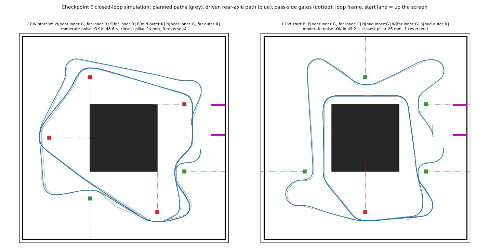

# chokeSLAM: WRO 2026 Future Engineers, obstacle challenge

chokeSLAM is the software of our self-driving car for the **WRO 2026 Future Engineers** obstacle challenge. The car must drive three laps of the 3 × 3 m track, pass every red pillar on its right and every green pillar on its left, and stop in the start section.

**The approach:**
- **Lap 1:** the car localizes itself lane by lane and plans a path through each lane as it discovers the pillars.
- **Laps 2 and 3:** it plans one optimised path from the map built on lap 1 and follows it twice.

- **Calibrating and running it on the car:** [docs/RUNNING_ON_THE_ROBOT.md](docs/RUNNING_ON_THE_ROBOT.md), the complete guide: wiring, firmware, Pi setup, every calibration in order with its tool and acceptance check, practice with the live dashboard, competition start, troubleshooting.
- **Design, every decision and the evidence for it:** [docs/CHANGES.md](docs/CHANGES.md) (checkpoints A–F).



*Two simulated rounds on rulebook layouts: planned paths in grey, the driven path in blue, pass-side lines dotted.*

---

## Contents

1. [How it works](#1-how-it-works)
2. [Hardware and how the software uses it](#2-hardware-and-how-the-software-uses-it)
3. [Code modules](#3-code-modules)
4. [Build, compile and upload](#4-build-compile-and-upload)
5. [Testing and simulation](#5-testing-and-simulation)
6. [Status and known limits](#6-status-and-known-limits)

---

## 1. How it works

### Localization (checkpoints A–D)
- **Initialisation.** One LIDAR scan, taken standing still at the start. It decides:
  - the round direction (CW or CCW), from which side has the opening past the island's end;
  - x, the distance from the outer wall, from the fitted side walls;
  - y, the distance along the lane, from the wall ahead, measured along the lane using the fitted yaw;
  - which of the lane's six pillar seats hold a pillar.
- **Tracking.** After that, the pose comes from the STM32's IMU heading and wheel encoder at 100 Hz. The tracker works in one frame per lane (x from the outer wall, y along travel) and switches frames at each corner.
- **Seat checks.** On lap 1, each new lane's seats are checked with the LIDAR as the car enters the lane. The LIDAR frames are de-skewed for the car's motion.
- **Colours.** The fisheye camera reads the colour of every pillar the LIDAR found.

### Planning and driving (checkpoint E)
- **Planner.** A visibility-graph planner works in one frame for the whole loop:
  - pillars and the parking-lot limitations are inflated obstacles;
  - a line from each pillar to the wall on its forbidden side enforces the pass side;
  - Dijkstra finds the shortest route and smooths corners with arcs the steering can actually make;
  - the car's real footprint is checked along the whole path.
- **Lap 1.** At each corner the car stops briefly while the LIDAR and camera decide the next lane, plans that lane, and drives it. It re-plans whenever a seat or a colour changes, stops to look again at a pillar whose colour is unknown, and backs up if no forward path exists.
- **Laps 2–3.** One final map, one closed lap path followed twice, then a stop inside the start section.
- **Driving.** The Pi closes the loop: a rear-wheel-feedback controller follows the path using the tracker's pose. It sends a steering angle and a speed to the STM32 50 times a second. The STM32 drives the servo and the motor's speed loop, and stops the motor if the Pi goes quiet for 250 ms.
- **Practice dashboard (checkpoint F2).** A browser page (`run_mission.py --dashboard` on the car, or a simulated car) draws the lanes, seats, colours and pose, and **continuously the path the planner builds from what has been perceived**. Its tuning panel changes 110 values live, including the STM32's servo map, steering lock and speed loop (no re-flash).
- **The run (checkpoint F).** The STM32 owns the start button: a press starts a run, a press during a run stops it, and a press after a run has stopped or finished starts a new one. Between runs the Pi re-initialises whenever the car stands still, and the STM32's LED shows when a press will start.

## 2. Hardware and how the software uses it

Component names are those in the CAD assembly (`ASMB.step`). Geometry was measured from the CAD model (CHANGES §16.3). The pose reference point is the rear-axle midpoint.

| Component | Connected to | Used by | Role |
|---|---|---|---|
| Raspberry Pi 5 | – | `run_mission.py` and everything in §3 | localization, planning, path following |
| RPLIDAR C1, mounted upside down, 134.6 mm ahead of the rear axle | Pi, USB serial | `lidar_source.py` | start scan, seat checks |
| OV5647 fisheye camera, 139.9 mm ahead, 127 mm high | Pi, CSI (Picamera2) | `camera_source.py`, `color_id.py` | pillar colour (red / green) |
| STM32F411 "Black Pill" | Pi, native USB (CDC) | `firmware/drive_bridge/` ↔ `stm32_link.py`, `drive_link.py`, `run_control.py` | sensor stream, steering and motor speed loop, watchdog, the run (start button), status LED (PC13) |
| BNO08x IMU (Game Rotation Vector), SPI1 | STM32 | `$IMU` line → `lane_tracker.py` | heading |
| GA25-370 gear motor with hall encoder (TIM5, PA0/PA1) | STM32 via BTS7960 H-bridge (PA2 / PA3) | `$IMU` line (distance), DRIVE frames (speed) | drive and odometry (14.853 ticks/cm) |
| JX PS-1171MG steering servo (PA8, 500–2500 µs; straight 76.5°, stops 20° / 140°) | STM32 | DRIVE frames (road-wheel angle) | Ackermann steering, wheelbase 135.9 mm; full-lock radius 27 cm left / 25 cm right (from encoder + IMU); the lock angles used, 36.6° / 40.5°, are **placeholders** (CHANGES §17.2) |
| Start button (PB12 to GND) | STM32 | run state in `$STA` → `run_control.py` | the one start button (rule 9.11): start / stop / restart |
| XL4016 buck converter, battery | – | – | power |

The pinout is the owner's `OpenRound.cpp`. The CAD model also contains VL53L0X distance sensors, a TCS34725 floor colour sensor (with a TCA9548A and LED2 / LED3) and an SSD1306 display. chokeSLAM does not use them.

### Pi ↔ STM32 link
- **STM32 → Pi**, text lines over USB:
  - `$IMU,<seq>,<t_ms>,<enc>,<yaw>` at 100 Hz: raw yaw and the cumulative encoder count.
  - `$STA,<seq_ack>,<status>,<run_state>,<run_id>,<pwm>,<speed_mmps>` at 20 Hz: status bits (enabled, watchdog, button, closed loop, IMU ok), the run (READY / RUNNING / STOPPED / FINISHED and a counter), and the motor PWM and measured speed.
  - `$PAR,<id>,<value>`: the STM32's echo of a tuning value.
  - `#` log lines when the run state changes.
- **Pi → STM32**, binary 11-byte DRIVE frames (the spec in `stm_link.py`): sync, sequence, flags, road-wheel angle (+ = left), speed in mm/s, and an XOR checksum. A STOP frame stops the car. Two flag bits the spec leaves free carry PI_READY (a press may start a run) and RUN_OVER (the Pi's run has ended). An 8-byte PARAM frame (`AA 56`) sets the firmware's tuning values; the Pi keeps them equal to `config.py`.

## 3. Code modules

### Runs on the robot
| File | What it does |
|---|---|
| `run_mission.py` | **The competition program.** Opens the STM32 link, LIDAR and camera and runs `run_control` at 50 Hz until stopped; sends STOP on exit |
| `run_control.py` | Start / stop / restart: re-initialises whenever the car stands still, reports ready, runs the mission while the STM32 says RUNNING, ends a run that finished |
| `mission.py` | Mission state machine: look, plan, drive, reverse, laps 2–3, finish |
| `vg_planner.py` | Visibility-graph planner: tangent arcs, arc-fit corners, lap checkpoints, footprint check |
| `field_map.py` | The planner's world in the loop frame: pillars, pass-side lines, island, parking lot; tracker pose → loop frame |
| `follower.py` | Path follower (rear-wheel feedback; pure pursuit as an option) and speed profile |
| `lane_tracker.py` | Pose from the IMU and encoder, lane switching at corners, seat re-checks, colour requests |
| `lane_init.py`, `direction_detect.py` | Initialisation: direction test, x, y, seats |
| `seat_occupancy.py` | Pillar present / absent / unknown at each of a lane's six seats, from one LIDAR frame |
| `color_id.py`, `camera_source.py` | Pillar colour from the fisheye camera |
| `deskew.py`, `timing.py` | LIDAR de-skew and the common clock for LIDAR and STM32 data |
| `lidar_source.py`, `scan_processing.py` | RPLIDAR C1 reader, calibration to the robot frame |
| `stm32_link.py`, `drive_link.py`, `stm_link.py` | STM32 link: reads `$IMU` / `$STA`, sends DRIVE frames |
| `lane_frame.py`, `mat_geometry.py`, `display.py` | Frames and field geometry |
| `config.py` | **Every setting**: ports, calibration, car geometry, planner, mission and follower parameters, each commented |

### Firmware (`firmware/`)
| Folder | What it is |
|---|---|
| `drive_bridge/` | **The firmware for `run_mission.py`** (Arduino IDE): `$IMU` / `$STA` stream, the run and the start button, DRIVE execution, servo map, speed loop, watchdog. `drive_protocol.h` is the hardware-free part (host-tested) |
| `stm32_imu_bridge/` | Sensor stream only (motor off): for tracking tests by hand |
| `obstacle_round_stream/`, `chokeslam_stream/` | The earlier v7 firmware with the stream added, and the stream as a portable header (reference) |

### Tools
| File | What it does |
|---|---|
| `drive_calibrate.py` | Measures the motor: fits the speed loop's feed-forward from open-loop runs, checks the closed loop |
| `run_init.py` | Initialisation from the real LIDAR, a saved scan or the simulator, with every intermediate number |
| `run_track.py` | `--bench`: STM32 calibration check; `--real`: initialisation + tracking; `--replay-scan/--replay-imu`: replay a recorded run |
| `measure_lidar_delay.py` | Measures the LIDAR vs STM32 time offset on the robot |
| `camera_check.py` | Bench check of the camera mount and colour thresholds |
| `dashboard_server.py` | Browser dashboard for practice: lanes, seats, colours, pose, live scan, the planned path (planner preview, or the mission's own path during a run), live tuning panel. Tracking mode (drive by hand) or mission mode (`--mission` in the mock, `run_mission.py --dashboard` on the car) |
| `mission_sim.py` | The simulated car and STM32 the mission-mode mock and `test_run_control.py` run on |
| `sim_closed_loop.py`, `sweep_closed_loop.py`, `layouts.py` | Closed-loop simulation of whole rounds on rulebook layouts (§5) |
| `simulation.py`, `live_sim.py`, `camera_sim.py` | Simulated LIDAR, STM32 and camera |
| `path_planner.py` | The original planner the checkpoint-E planner is built from (reference) |

## 4. Build, compile and upload

### STM32 firmware
1. Arduino IDE with the **STM32duino** core, and the libraries *SparkFun BNO08x Cortex Based IMU* and *Servo*.
2. Board: **Generic STM32F4 series → BlackPill F411CE**; USB support: **CDC (generic 'Serial' supersede U(S)ART)**; upload method: **STM32CubeProgrammer (DFU)**. Hold BOOT0 and tap NRST to enter DFU.
3. Open `firmware/drive_bridge/drive_bridge.ino` (keep `drive_protocol.h` next to it), compile and upload.

### Raspberry Pi
```bash
git clone https://github.com/josef-ami/chokeSLAM.git && cd chokeSLAM
sudo apt install python3-opencv python3-picamera2
pip install -r requirements.txt
sudo usermod -aG dialout $USER          # serial-port access (log out and in)
```
Python needs no compiling. Set the ports in `config.py`, then follow [docs/RUNNING_ON_THE_ROBOT.md](docs/RUNNING_ON_THE_ROBOT.md): link checks, calibration in order (§6), practice with the dashboard (§7–8), and starting `run_mission.py` automatically at power-up for competition rounds (§9).

### Without hardware
```bash
pip install -r requirements.txt
python3 sim_closed_loop.py --seed 3 --noise moderate    # one simulated round
python3 dashboard_server.py --mission                   # with config.MODE = "mock": http://localhost:5056/
```

## 5. Testing and simulation

Every module has a test suite (`test_*.py`); run each with `python3 test_<name>.py`. They are checked against independent geometry and ground truth rather than against the code itself. The real-hardware paths are tested through pseudo-terminals and stand-in drivers. The 23 September real scans are kept as regression tests (`test_data/`).

`sim_closed_loop.py` runs whole rounds with **the real code in the loop**:
- layouts drawn exactly as the rulebook describes;
- a simulated car (bicycle model with steering and speed lag);
- simulated LIDAR, STM32 and camera;
- a judge applying the rulebook: contact, wrong side, laps, finish, 3 minutes.

`test_run_control.py` runs start / stop / restart end to end: the firmware's run logic compiled from `drive_protocol.h`, in lockstep with the real Pi side on a simulated car.

`sweep_closed_loop.py` runs hundreds of these in parallel. Results on 200 layouts with the checkpoint-E placeholder steering lock (CHANGES §16.11); success is counted over runs that pass initialisation. **With the measured lock, success without noise drops from 100 % to 49 %** (§6 below):

| Noise | Success |
|---|---|
| none | 100 % |
| moderate (report preset) | 87 % |
| moderate, encoder calibrated to 0.5 % | 97 % |
| harsh (2 × moderate) | 45 % |

**With the current lock placeholders** (36.6° / 40.5°, checkpoint F2, CHANGES §18.5), success is lower: 49 % with no noise, 39 % under moderate noise, 49 % with the encoder calibrated, and 74 % under moderate noise with `PLAN_RADIUS_FACTOR` 1.0. There are no wrong seats or colours in any of these; the limit is the planner with a weaker lock (§6).

## 6. Status and known limits

- **Not yet run on the car.** The drive firmware has been compiled only on a PC against stand-in headers, never with the STM32 toolchain or on the STM32. The speed-loop values are placeholders to measure (`drive_calibrate.py`, [docs/RUNNING_ON_THE_ROBOT.md](docs/RUNNING_ON_THE_ROBOT.md) §6).
- **The steering lock is a placeholder.** 36.6° left / 40.5° right were converted from the 27 / 25 cm radii as if measured at the outer front wheel; the radii came from encoder and IMU data, so the real lock is probably smaller (31.8° / 34.3° at the outer rear wheel, 26.7° / 28.5° at the rear-axle midpoint). To be measured (CHANGES §17.2).
- **The turning radius breaks many plans (decision pending).** With the placeholder lock (36.6° left, 40.5° right), 49 % of initialised simulated starts succeed without noise, compared with 100 % with the old placeholder. Mostly the planner loops round where a left corner is too tight, and `test_vg_planner.py`'s full-lap check fails. The options are in CHANGES §17.5.
- **Initialisation refuses about 17 % of rulebook starts**, mostly CW starts where a pillar on the middle inner seat hides the opening past the island.
- **About 3 % of starts have no path.** The car stands about 300 mm behind a pillar that must be passed on the far side.
- **Heavy noise needs a pose correction during the laps.** Nothing corrects the pose after initialisation; that is by design so far.
- **Parking is not implemented.** The car stops inside the start section.
- `test_run_track.py` and `test_dashboard.py` need `LIDAR_TIME_OFFSET_S = 0` (their stand-in LIDAR doesn't apply the configured offset).

**Earlier design.** Before September 2026 this repository held a broadside-localization design with a mat-level dashboard (`localization.py`, `scan_prediction.py`). It was replaced by the design above, and is recoverable from git history (commit `dd9c8f4` and earlier).
