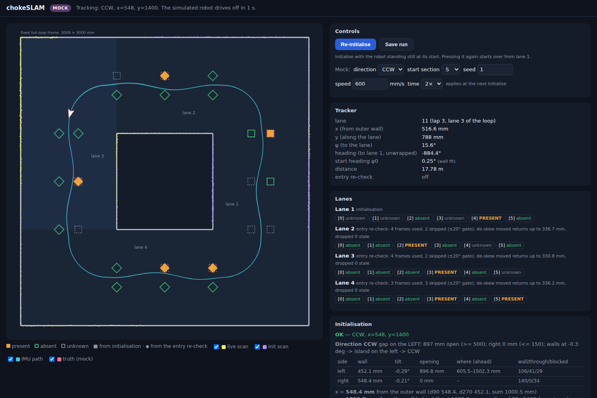

# chokeSLAM: changes and resulting design

This is the running record of every change made to this repository from September 2026 onwards, and of how the resulting product works. It covers every mechanism in detail, the reasoning behind each design choice, and the evidence for it. It is updated at every checkpoint.

| Checkpoint | Content | Status |
|---|---|---|
| **A** | Clockwise conventions, lane frame with x from the outer wall, removal of mat-level code, simulator heading fix, **direction (gap) test**, **initialisation of x / y / seats** | Implemented and tested. Real-robot scans analysed (§5.7); the approved changes from them are implemented (A.2, A.3); the LIDAR angle sign is **measured (−1)**, and the first scan's direction is **confirmed CW** (§5.7.3). **APPROVED (23 Sept, decision #34).** |
| **B** | STM32 → Pi feed (BNO08x yaw + hall encoder), lane tracker, turn detection, lane switching, entry-corner seat re-check, simulated STM32 feed, `run_track.py` review tool, de-skew of the re-check's LIDAR frames (P9) | **APPROVED (23 Sept, decisions #37 and #39).** |
| **C** | Dashboard rewritten lane by lane, mock mode in real time, tuning panel, Save run; fixes P10 and P11 to B's entry re-check | **APPROVED (23 Sept, decisions #45 and #46).** |
| **D** | OV5647 fisheye camera for pillar colour ID only, keyed off PRESENT seat verdicts (the owner's draft, executed with four owner decisions on points the draft left open or got wrong) | **Implemented and tested in simulation (§15, decisions #53–#65). Awaiting approval.** Camera lever arm, height, bearing sign and colour thresholds are unmeasured (§15.8). |
| **E** | Connection of the localization (tracker, seats, colours) to the owner's visibility-graph path planner: lap 1 lane by lane (look, then plan), laps 2–3 from one final map; closed-loop path following on the Pi; DRIVE link and drive firmware; car geometry from the CAD model; a closed-loop rulebook simulation | **Implemented and simulated (§16, decisions #66–#83).** Three proposals that change approved values (P1–P3) and nine additions found necessary in simulation (E-A1–E-A9) **await approval** (§16.12). Steering lock is a placeholder (§16.3). |

Nothing has been committed to git. Every change is an uncommitted edit on top of your last commit `dd9c8f4 added lane frame`, so `git diff` shows exactly what changed.

---

## Contents

1. [What was asked](#1-what-was-asked)
2. [Ground truth: the rulebook facts used](#2-ground-truth-the-rulebook-facts-used)
3. [Decision log](#3-decision-log)
4. [Conventions](#4-conventions)
5. [Initialisation, the complete mechanism](#5-initialisation-the-complete-mechanism)
6. [Problems found in the existing code, and what happened to each](#6-problems-found-in-the-existing-code-and-what-happened-to-each)
7. [File-by-file changes](#7-file-by-file-changes) (7.1 checkpoint A, 7.2 checkpoint B, 7.3 checkpoint C)
8. [Verification](#8-verification) (8.1 checkpoint A, 8.2 checkpoint B, 8.3 checkpoint C)
9. [Checkpoint B: the IMU tracking mechanism](#9-checkpoint-b-the-imu-tracking-mechanism)
10. [Checkpoint C: the dashboard](#10-checkpoint-c-the-dashboard)
11. [Things to measure or set on the real robot](#11-things-to-measure-or-set-on-the-real-robot)
12. [How to run](#12-how-to-run)
13. [Portable STM32 stream snippet](#13-portable-stm32-stream-snippet-50-awaiting-approval)
14. [The obstacle-round v7 firmware as the STM32 side](#14-the-obstacle-round-v7-firmware-as-the-stm32-side-52-awaiting-approval)
15. [Checkpoint D: pillar colour identification](#15-checkpoint-d-pillar-colour-identification-ov5647-fisheye)
16. [Checkpoint E: localization -> path planner, and the closed-loop simulation](#16-checkpoint-e-localization---path-planner-and-the-closed-loop-simulation)

---

## 1. What was asked

1. A procedure that decides whether the round direction is **clockwise or counter-clockwise**. It works by finding which side has a gap of about 1000 mm in the wall that runs along the direction of travel.
2. A dashboard that shows **only a lane**, together with the obstacles present. This was clarified later: lanes are added one by one as turns are made, until the whole lap is drawn.
3. A mechanism for **IMU input from an STM32 connected over USB to the Raspberry Pi 5**. It traces the motion along the lane and detects turns. Each turn causes a new lane to be drawn.
4. The LIDAR position fix and obstacle check are **initialisation only**. All motion tracking after that comes from the IMU.

Standing instructions:

- Assume nothing.
- Don't use prior context.
- Ask whenever in doubt.
- Run every feature past the owner for approval.
- Keep this document.

## 2. Ground truth: the rulebook facts used

All facts come from the *WRO 2026 Future Engineers General Rules*.

| Fact | Source |
|---|---|
| Racetrack inner size 3000 × 3000 mm (± 5) | 13.1 |
| Obstacle Challenge: distance between track borders always 1000 mm (± 10 at the International Final) | §8, "Obstacle Challenge rounds" |
| Four corner sections, four straightforward sections; the island is the centred 1000 × 1000 square | §5, Fig. 2, Fig. 11 |
| Traffic-sign seats sit 400 mm and 600 mm from either wall (the `400 / 200 / 400` chain), on the section's two boundary lines and its midpoint. In the lane frame that is y = 1000, 1500, 2000 | Fig. 11, Fig. 3 |
| Seat 50 × 50 mm; pillar 50 × 50 × 100 mm; "moved" circle 85 mm | 13.13, 13.19, 13.15 |
| 1–2 traffic signs per straightforward section | Fig. 8c (cards) |
| The robot starts in a start zone of the starting section, or in the parking lot | §5, §8 step 4, 9.7 |
| Parking lot is 200 mm wide, against the outer wall, 1.5 × robot length long, limited by two 200 × 20 × 100 mm magenta elements | §5 Fig. 4, 13.25 |
| When the lot is placed, the starting section's signs move to the seats nearer the inner wall | Fig. 8e |
| The robot is oriented so its front axle is nearer the next corner in the round direction, i.e. it faces the round direction | 9.8 |
| Data can't be entered by physical adjustment, so the direction has to be sensed | 9.9 |
| Direction and start position are drawn at random each round | 9.3, 9.4 |

## 3. Decision log

These are the owner's answers, numbered in the order they were asked.

| # | Question | Decision |
|---|---|---|
| 1 | Angle convention in the code | **Clockwise everywhere**: 0 = forward / grid north, 90 = right, 270 = left |
| 2 | Which side is the outer wall | **CCW → right, so x = d(90°); CW → left, so x = d(270°)** |
| 3 | Lane x-axis and obstacle bearing | **x = distance from the outer wall in both directions.** Bearing = `360 − atan2(dx, dy)` for CCW, `atan2(dx, dy)` for CW |
| 4 | Robot yaw at initialisation | **Exactly 0°** |
| 5 | Gap test wall model | **Parallel lines, yaw 0.** Superseded by #27 |
| 6 | Gap decision thresholds | **Opening ≥ 500 mm on one side and ≤ 150 mm on the other** |
| 7 | Start positions to support | **Start zones and parking lot** |
| 8 | What the STM32 sends | **Nothing defined yet, so propose a format** |
| 9 | y measurement | **Front-wall fan** (§5.4) |
| 10 | x measurement | **Raw ray median at 90° / 270°** with the lane-sum check |
| 11 | Where this document lives | **Markdown in the repo** (this file) |
| 12 | Mock mode | **Keep it, fix the heading (P3), add a simulated STM32 feed** |
| 13 | STM32 hardware | **BNO08x IMU + hall encoder on the drive motor** |
| 14 | Turn trigger | **Left to Claude.** Proposal approved: #25 |
| 15 | Obstacles on lanes after the first turn | **Re-run the LIDAR seat check on entry to each new lane** (relaxes item 4 for this purpose) |
| 16 | Dashboard lane extent | **Full lane (1000 × 3000). Once the 1st lane is complete, draw the 2nd lane in its place, and so on for the whole lap** |
| 17 | STM32 message format | **Approved** (§9.1) |
| 18 | USB link | **STM32 native USB (CDC)**, so `/dev/ttyACM*` and the baud rate is ignored |
| 19 | When the entry re-check runs | **Every frame until y = 1000; the first decided verdict per seat is kept and later frames fill unknowns** |
| 20 | Laps 2 and 3 | **Keep the lap-1 result; no re-check** |
| 21 | Dashboard extras | **Frozen init scan, live scan, IMU-traced path, tuning panel** (all four) |
| 22 | Canvas framing | **Fixed full-loop frame** |
| 23 | Start lane on later laps | **Init result only** |
| 24 | Modules the new design no longer uses | **Delete.** They stay recoverable from git history (the zip does contain history; an earlier statement that it didn't was corrected) |
| 25 | Turn rule | **Approved:** ≥ 45° toward the round direction **and** tracked y ≥ 2000, or ≥ 80° alone as a failsafe |
| 26 | Re-check alignment gate | **Only frames within ±20° of the new lane's grid north** |
| 27 | Gap test vs placement yaw (after the WRONG finding, §5.2.6) | **Fit the wall tilt inside the gap test only.** x, y and seats keep yaw 0 |
| 28 | (After the first real scan, §5.7) Lane width on the practice field | **About 930 mm by tape. Make it a config value** (`config.LANE_WIDTH_MM`). The rulebook's 1000 stays the default; the owner sets the field's measured width. Seat positions on such a field: to be asked separately |
| 29 | (After the first real scan) Side-wall measurement | **Use the dominant wall line within ±30° of 90°/270°** instead of the 2° ray median (supersedes #10's measurement; x is still "the distance at 90° / 270°") |
| 30 | (After the first real scan) Which side the pillar beside the robot was on | **The robot's right**, with the robot reported as facing CCW and the LIDAR mounted upside down. This contradicted the scan under either sign (§5.7.3); resolved by #31 and #33 |
| 31 | Sign-check scan (`test_data/real_2026-09-23_sign_check.json`) | An object placed about 30 cm to the robot's **right** read **raw 272°** (296 mm, 45 mm wide), so the upside-down LIDAR's raw angles run counter-clockwise: **`LIDAR_ANGLE_SIGN = −1`**, set in config per the §11 procedure |
| 32 | Field measurements and seat positions | **"For everything else, use the rulebook positions and measurements along with some margins of error."** So `LANE_WIDTH_MM` stays at the rulebook 1000 (the owner no longer sets a field-specific value, replacing #28's plan), the lane-width margin `LANE_WIDTH_TOLERANCE_MM` goes from 40 to **100 mm** (value chosen by Claude, pending approval, §5.7.4), and seats stay at the rulebook positions with the detector's existing margins |
| 33 | First scan: which side was the island on? | **The robot's right**, so it was a CW start. The earlier "CCW" was a mislabel. The code's answer (CW, x = 478 mm, y = 1464 mm) is confirmed |
| 34 | Checkpoint A approval | **Approved, all items:** the lane-width check (within the margin); lever arm and blind wedge kept in config.py; `run_init.py` as the init tool; the side-wall measurement; the measured sign −1 and the ±100 mm margin; the README note; the simulator reporting angles in the LIDAR's own convention; the real scans kept as regression tests. The owner noted that **the second scan (sign check) was taken with the robot facing the inner wall** |

| 35 | Checkpoint B: the tracker's starting heading | **"Wall-fit yaw, tracker only."** The tracker starts from the placement yaw that the gap test's wall fit measures (ψ0 = −wall angle). Initialisation's own x, y and seats keep yaw 0 (#4) |
| 36 | Checkpoint B: calibration values | **Use the owner's defaults:** "IMU clockwise reads negative", so `IMU_YAW_SIGN = −1`; "TICKS_PER_CM = 14.853", so `ENCODER_TICKS_PER_CM = 14.853` (the STM32's cumulative `enc` counts these ticks; 1 tick = 0.6733 mm). This replaces the `ENCODER_MM_PER_COUNT` planned in the first B design |

| 37 | Checkpoint B approval (§9.13 items 1–5) | **Approved, all items:** `stm32_link.py`, `lane_tracker.py` (including the 3000 mm/s encoder-glitch limit), `run_track.py` (including taking the tracker's reference sample at the moment of the start scan), the simulation additions and the three test files |
| 38 | P9: the LIDAR sweeps while the robot moves (§9.11) | **Option A, de-skew:** timestamp each LIDAR return, keep about 0.5 s of tracked-pose history, move each return to where the pose at the frame's end would see it, and add a way to measure the LIDAR vs STM32 delay on the robot |

| 39 | P9 fix approval (§9.13 items 1–7) | **Approved, all items:** `timing.py`, the `lidar_source` timestamps, `deskew.py` and the pose history, `LIDAR_TIME_OFFSET_S` with `measure_lidar_delay.py`, the `run_track` and simulation changes, and the tests |
| 40 | Next step | **Start checkpoint C** (the dashboard, §10) |
| 41 | Dashboard: when initialisation runs | **On button press.** The server starts the LIDAR and STM32 and shows the live scan, but initialises only when **Initialise** is pressed with the robot standing still. Re-initialise clears every lane, seat and path and starts again from lane 1 |
| 42 | Dashboard mock mode | **Live simulated laps.** The `run_mock` world in real time: a simulated robot drives 3 laps with random pillars through the same init → tracker → de-skewed re-check chain. Direction, start lane and seed are set in the panel, and Initialise restarts it. The truth is drawn faintly so verdicts can be checked |
| 43 | Tuning panel groups | **All four:** LIDAR mount and calibration; initialisation thresholds; tracker and IMU; seat detector |
| 44 | Extras beyond §10 | **A Save-run button** (start scan + IMU log in the `run_track --replay` format), **LIDAR health** (spin rate, time since the last return, backward steps), **de-skew stats** per lane. Not chosen: colouring the live scan by the old clustering |

| 45 | Checkpoint C approval (§10.9 items 1–6) | **Approved, all items:** the display frame, the drawing, the panel, the runtime (Initialise / Re-initialise, loop order, stream, Save run), the tuning panel, mock mode |
| 46 | P10 and P11 fixes (§10.7, §10.9 items 7–8) | **Approved, both:** frames judged at their end (late frames inside their window still count; frames the history doesn't fully cover are skipped), and the coverage check that turns an EMPTY with a hole in its window into UNKNOWN |
| 47 | STM32 firmware scope | **Sensor bridge only:** stream `$IMU` at 100 Hz; motor held off, servo held straight |
| 48 | STM32 toolchain | **Arduino IDE + STM32duino** |
| 49 | Debug lines from the STM32 | **None:** only `$IMU` lines go over USB; status on LED1 only |
| 50 | Portable stream snippet | `firmware/chokeslam_stream/chokeslam_stream.h`: protocol only, no hardware; the host sketch passes encoder, raw yaw, valid flag (§13) — **awaiting approval** |
| 51 | Bridge status LED | **"rewrite the stm32 bridge sketch to show error over pc13":** the status blink moves from LED1 (PB12, not connected on the robot) to the Black Pill's on-board LED, PC13 (lit when LOW). Codes unchanged: fast 100 ms = IMU fault (not found at boot or no report for 100 ms), slow 500 ms = IMU fine but no line got out for 200 ms, solid = streaming. PB12–PB14 are held off. Constantly off after boot = firmware not running |
| 52 | Pi side and the obstacle-round v7 firmware | **"Add a stream to this sketch"; chokeSLAM alone owns the port.** `firmware/obstacle_round_stream/` = the owner's v7 sketch + `chokeslam_stream.h` sending the unchanged `$IMU` line. The Pi now **skips `#` and `!` lines** (counted as firmware log, shown on the bench and dashboard) instead of counting them bad; this relaxes #49 on the Pi side (§14) — **awaiting approval** |
| 53 | (D, draft #47) Camera lever arm | Co-located with the LIDAR's mount, **exact offset unmeasured**. Own keys `CAMERA_OFFSET_FORWARD_MM` / `_LATERAL_MM` (+ left, as the LIDAR), placeholder = the LIDAR's values |
| 54 | (D, draft #48) Camera mount | Optical axis horizontal, forward, boresighted at 0°. Body upside-down → `CAMERA_ROTATE_180`, applied in exactly one place (`color_id.correct_frame`) |
| 55 | (D, draft #49) Trigger | The moment a seat becomes PRESENT (init or entry re-check), once per seat |
| 56 | (D, draft #50) Retry | Up to `COLOR_ID_MAX_ATTEMPTS` (5) frames within `COLOR_ID_WINDOW_S` (0.3 s); first confident read wins; else UNKNOWN. **Values proposed, pending approval.** The window's start is changed by #63 |
| 57 | (D, draft #51) Output | New fields on the seat record: `color` (`red` / `green` / `unknown`, `pending` while open) and `color_reason`. The draft named `SeatReading`; the stored per-seat record is `lane_tracker.SeatState`, so the fields went there |
| 58 | (D, draft #52) Lens model | The supplied `cv2.fisheye` calibration, used directly. **The draft's "~160° HFOV" does not match it** (see #63) |
| 59 | (D, draft #53) Vertical framing | The owner confirms the pillar is in frame at every expected range (120 mm and up). The ROI's vertical extent is set by #65 |
| 60 | (D, draft #54) Runtime | OpenCV + numpy in Python, next to `lane_tracker.py` |
| 61 | (D, draft #55) Colour-ID clock | The camera's own frames and timestamps; nothing is timed against `SweepClock` / `LinkClock` or the LIDAR's spin |
| 62 | (D) Which pose a frame is judged from | **"Pose at capture":** each frame uses the lane pose at its own capture time (`PoseHistory.lane_pose_at`) plus the camera lever arm, recomputed per frame from the seat's fixed lane position. This replaces the draft's "bearing stored on the seat" (D.2.7), which would be up to 300 mm stale by the end of the 0.3 s window |
| 63 | (D) Field of view | The K/D at 640×480 give image edges at about +46° / −50° and a polynomial that folds back at 61.3° (70° would land on column 629, 80° on column 25). **"Wait until it comes into view":** only boxes entirely below the fold with their centre in the image are used. Out-of-view frames use no attempts; the window opens at the first in-view frame; a request still open when its lane is left closes as UNKNOWN |
| 64 | (D) Capture | **Picamera2** at 640×480 (`RGB888` = BGR for OpenCV) in a background thread, newest frame only, stamped with the sensor timestamp on `time.monotonic()` (checked; arrival time as fallback, counted) |
| 65 | (D) ROI height; dashboard | **"From camera height":** new key `CAMERA_HEIGHT_MM` (unmeasured, placeholder 150). The box is the pillar's near face (50 × 100 mm) from floor to top, projected through the lens and widened 1.5×. **"Colour the seats":** PRESENT seats filled red/green once identified (amber while pending or UNKNOWN); hover and Lanes panel show colour and reason; a Camera card |

All three checkpoints are approved: A (#34), B (#37, #39) and C (#45, #46). What is left is measuring and checking on the real robot (§11). The STM32 bridge firmware (`firmware/stm32_imu_bridge/`, decisions #47–#49) awaits approval: it could not be compiled here (the Arduino toolchain can't be downloaded in this sandbox), so its first build is on your machine. The portable snippet (#50, §13) also awaits approval. The bridge shows its status on the on-board LED PC13 (#51). The obstacle-round firmware with the stream added, and the Pi skipping its log lines (#52, §14), await approval. Checkpoint D (pillar colour, #53–#65, §15) is implemented and awaits approval.

## 4. Conventions

### 4.1 Angles

Every angle in the codebase is **clockwise**.

- **Robot-relative LIDAR angle:** 0 = forward, 90 = right, 180 = back, 270 = left.
- **Robot-frame cartesian axes:** `fwd_mm` (+ ahead) and `right_mm` (+ right), with `angle = atan2(right, fwd)`. These are `ScanPoint.fwd_mm` / `right_mm` in `scan_processing.py`. They replaced the old `x_mm` / `y_mm`, which meant forward/left.
- **Raw sensor angle to robot angle:** this mapping happens in exactly one place, `scan_processing.clean_and_project`:
  `corrected = (LIDAR_ANGLE_SIGN × raw + LIDAR_ANGLE_ZERO_OFFSET_DEG) mod 360`
  `corrected` must come out clockwise with 0 = chassis forward. With a sensor whose raw angle already runs clockwise from forward, SIGN = +1 and OFFSET = 0, which is the current config. How to check this on the bench is in §11.

### 4.2 The lane frame (`lane_frame.py`)

Each lane has its own frame, anchored to the direction of travel:

- **y** runs along the lane in the direction of travel. y = 0 is the wall behind (the corner the robot entered from) and y = 3000 is the wall ahead.
- **x** is the distance from the **outer** wall, in both round directions. x = 0 is the outer wall and x = 1000 is the island wall.
- **Bearings** are clockwise from the lane's **grid north**, which is +y, the direction of travel.

Because x is always measured from the outer wall, the direction +x points depends on the round direction:

| Round | Island is on the… | Outer wall is on the… | +x points… | handedness *h* |
|---|---|---|---|---|
| CCW (left turns) | left | right, so x = d(90°) | left | −1 |
| CW (right turns) | right | left, so x = d(270°) | right | +1 |

A clockwise bearing *b* is the lane-frame unit vector `(h·sin b, cos b)`. A lane vector `(dx, dy)` has bearing `atan2(h·dx, dy)`, which works out as:

- **CCW:** `360° − atan2(dx, dy)`. This is the agreed "2π − atan" form.
- **CW:** `atan2(dx, dy)`.

The two-argument `atan2` matters. At initialisation the robot stands between the seat rows, so seats lie beside it and behind it (dy ≤ 0). A one-argument `atan(dx/dy)` would fold those forward or divide by zero.

Helpers in `lane_frame.py`:

- `handedness`, `outer_wall_side`, `outer_wall_lidar_angle`
- `bearing_of`, `unit_of_bearing`
- `offset_in_lane`: a robot-fixed point (lever arm) in lane coordinates
- `corner_transform`: see §9.4
- `lane_to_global` / `global_to_lane` / `grid_north_bearing`: only for building simulated worlds

### 4.3 The global mat frame (`mat_geometry.py`)

This frame is used only to build worlds for the simulator and the tests.

- Origin is the outer wall's bottom-left inside corner, +X east, +Y north.
- Headings are grid bearings, clockwise from +Y.
- Contents: `OUTER_SIZE_MM = 3000` (13.1), `LANE_WIDTH_MM = 1000` (§8), the island box and the outer box.

The robot's own decision path never uses this frame.

## 5. Initialisation, the complete mechanism

The code is in `lane_init.py` (pipeline), `direction_detect.py` (direction), `seat_occupancy.py` (seats) and `scan_processing.clean_and_project` (input).

### 5.1 Input

Initialisation takes **one LIDAR snapshot** with the robot stationary at its start pose, facing the round direction (9.8). The existing behaviour is kept: `lidar_source.RPLidarC1Source` keeps the latest reading per 1° bucket, and one snapshot of that table is used.

The snapshot passes through `clean_and_project`, which:

- drops ranges outside 60–6000 mm and low-quality returns
- applies the mount calibration (§4.1)

The result is a list of `ScanPoint`s with clockwise `angle_deg` and `dist_mm`.

The pipeline runs four steps in order. Each must succeed for the next to run:

**direction → x → y → seats**

Any failure produces `InitResult.ok = False` with a reason. The pipeline never guesses.

The robot's **yaw is taken as exactly 0** in every step (decision #4): LIDAR 0° is treated as the lane's grid north. The single exception is inside the gap test, which fits the walls' actual tilt for its own use only (decision #27, §5.2.6).

### 5.2 Direction: the gap test (`direction_detect.py`)

#### 5.2.1 Why there is a gap on exactly one side

The robot starts in a straightforward section, so y is roughly 1000–2000, with one wall on each side.

- **The outer wall is the boundary of the whole field.** It runs unbroken from y = 0 to y = 3000, and nothing can be seen through it.
- **The island wall is only 1000 mm long** (y = 1000–2000). Past its far end, from y = 2000 to 3000, there is no wall. That is the opening into the next lane: 1000 mm long, ending at the wall ahead.

So looking forward along each side, one side shows about 1000 mm of opening and the other shows none. The island is on the robot's left when driving CCW and on its right when driving CW:

- **gap on the LEFT (270° side) → CCW**
- **gap on the RIGHT (90° side) → CW**

The matching gap behind the robot (y = 0–1000) is ignored. It lies mostly inside the rear blind wedge.

#### 5.2.2 The procedure

Angles are clockwise. The robot frame is (f, s), with f = r·cos a ahead and s = r·sin a to the right.

**Step 1 – Side walls** (`measure_side_wall`; decision #29, which replaced the 2° ray median after the first real scan, §5.7). For each side:

1. Take the returns within ±`SIDE_WALL_HALF_DEG` (30°) of that side's 90° (right) or 270° (left), and their perpendicular distance |s|.
2. Histogram |s| in `SIDE_WALL_BIN_MM` (20 mm) bins, each bin counted together with its two neighbours. **The wall is the farthest peak** that has at least `SIDE_WALL_MIN_POINTS` (10) returns **and** lies no more than `LANE_WIDTH_MM + LANE_WIDTH_TOLERANCE_MM` from the robot.
   - Why the farthest: a pillar is always nearer than the wall behind it. In the real scan, the pillar beside the robot gave 17 returns at 165 mm and the wall behind it 42 at 453 mm.
   - Why bounded by the lane width: without the bound, a robot level with the island's start picked the next lane's far outer wall (2300 mm away), seen through the opening behind it. That was found while implementing this and fixed before any results were reported. A side wall can never be farther than one lane width.
   - Returns seen through an opening scatter in |s| rather than forming a peak.
3. Fit a total-least-squares line to the returns within `SIDE_WALL_BAND_MM` (100) of that peak. Drop returns more than `SIDE_WALL_INLIER_MM` (30) off the line and refit, up to three times. At least 10 inliers must remain.
4. **d_right / d_left = where the 90° / 270° ray meets that line.** This is still "the distance at 90° / 270°", now measured against the wall itself rather than whatever the single ray happens to hit.

- No wall on a side gives UNDETERMINED.
- **Lane-sum precondition** (pending approval): d_left + d_right must equal `config.LANE_WIDTH_MM` (rulebook 1000, decision #32) ± `LANE_WIDTH_TOLERANCE_MM` (100 mm, decision #32), otherwise UNDETERMINED.
- The measurement uses raw returns, **not** `scan_processing` clusters, so the cluster corner-merge problem (P1, §6) cannot affect it.

**Step 2 – Wall tilt.** This step was approved after the finding in §5.2.6.
- The two fitted lines' directions must agree within `GAP_FIT_AGREE_DEG` (2°), because the walls are parallel. Otherwise UNDETERMINED.
- The lane direction is the mean of the two.
- Each side wall is modelled as the line along the lane direction through that side's inliers.
- The tilt is used only here. x, y and the seats still take yaw = 0.

**Step 3 – Classify the forward returns.** For every return in that side's forward quadrant (right: 0–90°, left: 270–360°):
- Skip rays within `GAP_MIN_ANGLE_FROM_FWD_DEG` (1°) of dead-ahead, and rays whose crossing lies behind the robot.
- Compute:
  - `r_line` = the range at which the ray meets the side-wall line
  - `f` = how far along the lane that crossing is
- Classify the return:
  - `r > r_line + GAP_MARGIN_MM` (80): **passed through** the wall line at f
  - `|r − r_line| ≤ 80`: **wall present** at f
  - `r < r_line − 80`: **blocked** by something nearer (pillar, parking-lot limitation), so no information

**Step 4 – Measure the opening.** `opening(side) = max(f) − min(f)` over that side's passed-through returns, or 0 if there are none.

**Step 5 – Decide.**

| Condition | Result |
|---|---|
| opening(left) ≥ `GAP_OPEN_MIN_MM` (500) and opening(right) ≤ `GAP_CLOSED_MAX_MM` (150) | **CCW** |
| opening(right) ≥ 500 and opening(left) ≤ 150 | **CW** |
| anything else | **UNDETERMINED** (`direction = None`) |

For information, the result also reports:
- the fitted wall angle, which is minus the placement yaw
- both openings, where each begins and ends
- the per-side wall / through / blocked counts

#### 5.2.3 Why "passed through" rather than "where the wall ends"

A pillar, or the magenta parking-lot limitation, can make the outer wall *look* as if it ends early, because its far part is hidden behind the obstacle. But no ray can pass *through* the outer wall, because it is the field boundary. So occlusion can only shrink the measured opening on the island side, which at worst gives UNDETERMINED. It can never create an opening on the outer side.

#### 5.2.4 Why the opening reads about 900 mm, not 1000

Past the island's end, the ray continues into the next lane and stops at the extension of the wall ahead. Close to that wall it passes the side-wall line by less than the 80 mm margin, so the last ~100 mm of the opening are classified as "wall present". This is why the threshold is ≥ 500 rather than ~1000.

Measured: the opening starts within 18 mm of the island's end in every noiseless case. Its length is 855–932 mm, with a median of about 900 across the sweeps.

#### 5.2.5 Failure behaviour

UNDETERMINED stops initialisation (`InitResult.ok = False`) and reports both openings. The existing behaviour is kept: the operator re-runs initialisation. In the simulation the gap test decides in 95–96% of starts, and UNDETERMINED in the rest. Nearly all UNDETERMINED cases are a pillar next to the robot hiding most of the real opening.

#### 5.2.6 The placement-yaw finding (why step 2 exists)

The first implementation modelled each wall as a line parallel to the robot's forward axis at d(90°) / d(270°). That was decision #5.

On 1,600 simulated starts per yaw range, that model gave:

| Placement yaw | Correct | UNDETERMINED | **WRONG** |
|---|---|---|---|
| 0 | 1546 | 54 | 0 |
| ±1° | 1459 | 141 | 0 |
| ±2° | 1264 | 335 | **1** |
| ±3° | 1141 | 457 | **2** |
| ±5° | 991 | 606 | **3** |

Mechanism of the wrong cases:
- The robot is turned a few degrees toward the island.
- The outer wall therefore tilts *away* from the parallel model.
- Far ahead, its returns come back beyond the model line and look "passed through", faking an opening on the outer side.
- In every wrong case, a pillar on the mid-inner seat just ahead of the robot hid most of the real opening at the same time.

A wrong direction mirrors x and every seat for the whole run, so the owner chose to fit the wall tilt inside the gap test (decision #27). With the tilt fit, results on the same worlds:

| Placement yaw | Correct | UNDETERMINED | WRONG |
|---|---|---|---|
| 0 | 1545 | 55 | 0 |
| ±1° | 1543 | 57 | 0 |
| ±2° | 1543 | 57 | 0 |
| ±3° | 1545 | 55 | 0 |
| ±5° | 1534 | 66 | 0 |
| ±8° / ±12° (960 each) | 915 / 891 | 45 / 69 | 0 |

The wrong cases are kept as a regression test, `test_previously_wrong_scenarios`. On those scans, the tilt-fitted test is wrong 0 times out of 50, while the old model is wrong 30 times out of 50.

### 5.3 x: distance from the outer wall (`lane_init.measure_x`)

- `d(90)` and `d(270)` come from the same side-wall lines as the gap test (step 1 above; the direction test's fits are passed on so both steps see exactly the same walls).
- **Sanity check:** `|d(90) + d(270) − LANE_WIDTH_MM| ≤ LANE_WIDTH_TOLERANCE_MM (100)`, otherwise x is **rejected** with a reason, not trusted. In practice the gap test's identical precondition fails first.
- The sensor's distance to the outer wall is `x_sensor = d(90)` for CCW and `d(270)` for CW.
- **Lever arm:** `x = x_sensor + h × LIDAR_OFFSET_LATERAL_MM`, with h = −1 for CCW and +1 for CW, and LATERAL positive to the robot's left.
  - Reasoning, CCW case: if the LIDAR is L to the left of the reference point, the reference point is L nearer the right-hand outer wall, so x_ref = x_sensor − L.

Measured with the wall-line measurement: median error 0.2 mm, max 1.2 mm (it was 1.1 / 5.5 mm with the 2° rays). Accepted in 95% of simulated zone starts and 100% of lot starts. No accepted value was ever more than 30 mm off. A pillar 275 mm beside the LIDAR, which the 2° ray reads, no longer affects x (`test_pillar_beside_lidar`).

### 5.4 y: along the lane (`lane_init.measure_y`)

This is still the agreed `y = 3000 − (distance to the wall ahead)`, but the distance is measured over a **fan**, not the single 0° ray:

```
for returns with |angle| <= FRONT_FAN_HALF_DEG (30):
    f = r * cos(angle)                       # forward distance
front = median of f over returns with  f >= max(f) - FRONT_BAND_MM (40)
y_sensor = 3000 - front
y = y_sensor - LIDAR_OFFSET_FORWARD_MM       # reference point
```

The wall ahead is the farthest thing straight ahead that is still inside the field, so anything nearer is something standing in front of it. Rays that see through the island-side opening end on the same wall-ahead line, because it extends across the next lane, so they agree with it.

- **Sanity check:** 0 < y < 3000.
- **Why not d(0°):** in simulation, the single 0° ray read a pillar in 42 of 440 zone starts and the parking-lot limitation in 88 of 88 lot starts. That is P2 (§6). The regression tests show d(0) giving y = 2325 when the truth is 1300 (pillar ahead), and y = 2775 when the truth is 1500 (limitation). The fan gives 1300 and 1500.

Measured: median error 0.4 mm and max 4.0 mm at yaw 0. Placement yaw biases it, because yaw is taken as 0: max 7 / 20 / 39 mm at ±1 / 2 / 3°.

### 5.5 Seats: present / absent / unknown (`seat_occupancy.py`)

The detector's logic is unchanged. Only its frame and bearing changed (§4.2).

**Seat table** (rulebook, Fig. 11), lane frame, x from the outer wall:

| index | name | x | y |
|---|---|---|---|
| 0 | near-outer | 400 | 1000 |
| 1 | near-inner | 600 | 1000 |
| 2 | mid-outer | 400 | 1500 |
| 3 | mid-inner | 600 | 1500 |
| 4 | far-outer | 400 | 2000 |
| 5 | far-inner | 600 | 2000 |

The old names (near-left / near-right, …) followed the old x-from-left-wall frame.

**For each seat:**

1. Move from the pose reference point to the **sensor**, using the lever arm (`lane_frame.offset_in_lane`).
2. `dx, dy` = seat − sensor.
3. **Bearing**: `bearing_to(dx, dy, direction)`, i.e. `360 − atan2(dx, dy)` for CCW and `atan2(dx, dy)` for CW. The LIDAR angle to look at is `(bearing − yaw) mod 360`. At initialisation yaw = 0, so the LIDAR angle equals the bearing. (The old code mirrored this with `−bearing` because its LIDAR frame was counter-clockwise; that conversion no longer exists.)
4. **Expected range to the pillar's near face** = distance to the seat − 25 mm.
5. **Search window**: the pillar's angular half-width at that range plus `angular_margin_deg` (4°).
6. **Range tolerance**: `range_tol_mm` (70) + 3% of range + `seat_position_slack_mm` (10).

**Verdict rules, in order:**

- **UNKNOWN** if the seat can't be observed. The first check that applies wins:
  - its near face is closer than `min_observable_face_mm` (120), the sensor dead zone
  - it lies inside the **rear blind wedge** (105° centred on 180°)
  - there are no returns in the window
- **PRESENT** if the window contains a contiguous run of at least `min_points` (2) returns whose range steps are ≤ 40 mm, whose mean range is within tolerance of the expected face, and which is no wider than `max_width_factor` (2.5) × the pillar's angular width.
- Otherwise, UNKNOWN if:
  - the nearest return is **short** of the seat by more than the tolerance (line of sight blocked)
  - a return sits **at the seat's range** but isn't pillar-shaped (ambiguous, not absence)
  - a pillar there would have given fewer than `min_expected_hits` (2) returns at this scan's measured angular resolution (a far pillar's one or two returns can be lost to dropout)
- **ABSENT** only if every return in the window is clearly *beyond* the seat, and a pillar there would have been resolvable.

UNKNOWN is never treated as absent anywhere.

**One source of truth (pending approval).** The detector used to have its own lever arm and blind-wedge defaults (`DetectParams.lidar_offset_*`, `blind_arc_*`), separate from `config.py`. Setting only one of them would make x/y and the seats disagree about where the sensor is. `lane_init.detect_params_from_config()` now fills them from `config.LIDAR_OFFSET_*` and `config.REAR_BLIND_ARC_*`.

At initialisation, the robot stands between the seat rows. Seats beside it or behind it therefore fall in the blind wedge or dead zone, and are UNKNOWN. In simulation, 43% of init verdicts were UNKNOWN, 0 were wrong. By decision #23, the start lane keeps this result all run.

### 5.6 Output

`InitResult` contains:

- `ok`, `reason`
- `direction`: the full `DirectionResult`
- `x`: `XReading` with d90, d270, lane sum and x before and after the lever arm
- `y`: `YReading` with front, farthest f, returns used and y before and after the lever arm
- `yaw_deg = 0`
- `seats`: 6 `SeatReading`s with the state, a human-readable reason and every intermediate number

### 5.7 The first real-robot scan (23 September)

`run_init.py --real --dump scan.json` on the robot. The scan is kept as `test_data/real_2026-09-23_pillar_ahead_and_beside.json`, and `test_real_scans.py` replays it.

Setup, as reported by the owner:
- practice field
- LIDAR mounted **upside down**
- robot facing **CCW** along the track
- one pillar ahead and one beside the robot, which the owner says was on the robot's **right**

#### 5.7.1 What the scan contains

Angles are raw, as read with `LIDAR_ANGLE_SIGN = +1`.

| Raw angle | Content |
|---|---|
| 129°–233° | Chassis at 3–19 mm. The rear blind wedge **measures 105° wide, centred on 181°**, which matches config (180° / 105°). |
| 352°–11° | A pillar dead ahead, its face at 143 mm |
| 262°–278° | A pillar beside the LIDAR, its face at 165 mm (about 47 mm wide) |
| 90° side | A straight wall at 474–478 mm, continuous to the wall ahead: the outer wall |
| 270° side | A straight wall at 453–455 mm that ends about 600 mm ahead; past it, rays travel 1500–1960 mm. That is the island's end and the opening. |
| about 330° | Something about 1 m away on the island wall's line, past its end. Probably a pillar in the next lane. |
| ahead | The wall ahead at 1536 mm |

Other readings:
- The two side walls are **parallel** (fitted tilts −3.1° and −3.8°) and **926–934 mm apart**. The robot sat about 3.5° off parallel.
- The opening from the island's end to the wall ahead measures about 930 mm. That is consistent with a 3000 mm outer square with about 930 mm lanes (island about 1140 mm).

#### 5.7.2 Why initialisation refused, and what changed

1. **The 2° ray at 270° read the pillar** (166 mm), not the wall behind it, so d(90) + d(270) = 637. This is P6, fixed by decision #29 (step 1 above).
2. **The lane is about 930 mm, not 1000**, so the ±40 mm lane-width check would refuse this field at any pose. First handled by decision #28 (a field-specific width), then replaced by decision #32: rulebook 1000 with a ± 100 mm margin (§5.7.4).

With the wall-line measurement, the rulebook lane width with its 100 mm margin (decision #32) and the measured sign (−1, decision #31), the same scan initialises:

```
direction : CW   -- gap on the RIGHT: 809 mm open; left 0 mm; walls at +3.5 deg
x         : 478 mm from the outer wall   (outer wall on the left: d270 478, d90 455, sum 933)
y         : 1464 mm   (front 1536 mm; the single 0-deg ray reads the pillar at 146 mm)
seats     : all six UNKNOWN (blind wedge, dead zone, or behind the pillar ahead)
```

#### 5.7.3 The LIDAR angle sign (measured) and the first scan's direction (confirmed)

The first scan put the pillar beside the robot and the island opening on the **same** side (raw 270°). So "robot facing CCW" (island on the left) and "pillar on the right" couldn't both hold.

The **sign-check scan** (`test_data/real_2026-09-23_sign_check.json`) settled the sign:
- The robot was on the field **facing the inner (island) wall** about 400 mm away (owner, #34; the scan agrees: a finite wall about 400 mm ahead with rays passing both of its ends out to 1.2–2 m), with one object placed about 30 cm to its right, looking the way it faces.
- The object read **raw 272°** (296 mm, about 45 mm wide).
- With the LIDAR upside down, its raw angles run counter-clockwise, so **`LIDAR_ANGLE_SIGN = −1`** (decision #31). `test_real_scans.py` pins this: under the configured sign the object must read about 90°. It reads 87.7°.
- Initialisation **refuses** this scan ("no side wall"), which is correct: facing a wall is not a lane start pose. The test pins that too.
- The chassis wedge (raw 128–232°) and the zero offset are unaffected.

Consequence for the first scan: raw 270° is the robot's **right**, so the island opening was on the robot's right, which is a **clockwise** start. The owner reported CCW. Every other reading of that scan agrees with the island being on the pillar's side:
- a wall that ends and rays that pass beyond it
- a continuous wall on the other side
- a pillar sitting on the island wall's line past its end, where the next lane's seats are

**Confirmed (decision #33):** asked which side the island was on in that first placement, the owner answered **the robot's right**. The start was CW, the earlier "CCW" was a mislabel, and every reading now agrees. `test_real_scans.py` is therefore a ground-truth test: CW, x ≈ 478 mm, y ≈ 1464 mm.

#### 5.7.4 Rulebook measurements with margins (decision #32)

The owner's instruction: use the rulebook positions and measurements with margins of error.

- **Lane width:** `LANE_WIDTH_MM` = 1000 (rulebook). The margin `LANE_WIDTH_TOLERANCE_MM` goes from 40 to **100 mm**. This value is Claude's choice, pending approval, for these reasons:
  - The practice field measured 926–934 mm, about 70 mm under, and passes with about 25 mm to spare.
  - A side reading that *isn't* a wall is still refused. Seats stand 400 mm from either wall, so a pillar standing in for a wall is off by at least about 375 mm; anything seen through an opening is farther than the lane.
  - The wall search's outer bound becomes 1100 mm.
  - The simulated rulebook suites give identical results with 100 as with 40: still 0 wrong directions, 95% / 100% initialised in zones / lot.
- **Seats:** rulebook positions (Fig. 11). The detector's existing margins are unchanged:
  - range: 70 mm + 3% + 10 mm slack
  - angle: 4° plus the pillar's own half-width
  - UNKNOWN whenever it can't be sure
- **Lane length / island:** rulebook (3000 / 1000). y still comes from the wall ahead, so a field whose island is longer than 1000 (as this one appears to be) doesn't affect x or y. It only affects whether the opening is found; it was: 809 mm.

## 6. Problems found in the existing code, and what happened to each

| ID | Problem | What happened |
|---|---|---|
| C1 | The code documented a **counter-clockwise** LIDAR frame (90 = left) with `LIDAR_ANGLE_SIGN = +1` passing raw angles through. The owner's readings are clockwise (90 = right). | Codebase converted to clockwise (decision #1). |
| C2 | `localization.compute_start_of_run_fix` took the outer wall to be on the **left** for CCW, but geometry puts it on the right. `lane_frame.py` had flagged this as "Finding 3". | Replaced by `lane_init.measure_x` with CCW → d(90) (decision #2); `localization.py` deleted. |
| C3 | `seat_occupancy.py` measured x from the **left** wall, but the owner's method measures it from the **outer** wall. | Converted (decision #3). |
| C4 | The bearing formula `2π − atan(dx/dy)`, taken literally, is correct only for CCW, and a one-argument atan folds seats beside or behind the robot. | Implemented as `360 − atan2` (CCW) / `atan2` (CW) (decision #3). A test checks it against global geometry, worst error 1.7 × 10⁻¹³°. |
| P1 | `localization._find_wall_near` (cluster-based side-wall finder) failed to find one side wall in 55 of 320 simulated empty-field starts (17%). The far side wall and the wall ahead merge across the corner into one non-flat cluster, which is then rejected. | Not needed any more. x uses raw rays (decision #10) and the gap-test fit uses raw returns. The clustering in `scan_processing.py` remains only to colour the dashboard's point cloud. Not fixed. |
| P2 | `y = 3000 − d(0°)` reads a pillar standing roughly in line ahead, or the parking-lot limitation when starting in the lot. | Replaced by the front-wall fan (decision #9). |
| P3 | The mock simulator's heading formula (shared with `localization.driving_heading_deg`, "Finding 2" in the old `lane_frame.py`) pointed the robot 180° away from its direction of travel. | Simulator rewritten. Heading = the lane's grid north + yaw, derived from geometry (decision #12). |
| P4 | Lever arm and blind wedge had two independent settings, one in `config.py` and one in `DetectParams`. | Unified (§5.5), pending approval. |
| P5 | The parallel-wall gap model can give the WRONG direction under 2°+ placement yaw when a pillar hides the opening (§5.2.6). | Tilt fit inside the gap test (decision #27). |
| P6 | (Real scan) The 2° ray median at 90°/270° reads a pillar standing beside the LIDAR instead of the wall behind it. | Side walls measured as the farthest well-supported line within ±30° (decision #29). |
| P7 | (Real scan) The practice field's lane is about 930 mm, and the code assumed the rulebook's 1000 ± 40. | Rulebook 1000 kept, margin widened to ± 100 mm (decision #32; `config.LANE_WIDTH_MM` remains a config value). |
| P8 | (Real scans) `LIDAR_ANGLE_SIGN = +1` was wrong for the upside-down mount: every left/right would have been mirrored, and CW read as CCW. | Measured and set to −1 (decision #31). |
| P9 | (Checkpoint B, new code) The entry re-check pairs a LIDAR frame, which is one ~100 ms revolution, with a single tracked pose. On a moving robot that gives 4.5% (600 mm/s) to 11% (1000 mm/s) wrong entry verdicts in simulation. | De-skew (decision #38, §9.11): **0 wrong** in the same simulation. Approved (#39). |
| P10 | (Checkpoint B code, found testing C) While the robot turns, a sector at the LIDAR revolution's seam is seen by neither end of the revolution. A pillar standing there left a hole with the wall visible on both sides, which the seat detector read as EMPTY. | Coverage check in the entry re-check: an EMPTY whose search window contains a hole wider than the pillar becomes UNKNOWN (§10.7). Approved (#46). |
| P11 | (Checkpoint B code, found testing C) A frame processed late was de-skewed to, and judged from, the robot's newest pose rather than the pose where the frame was taken. | Frames are judged at their end (the pose and window of that moment); late frames still count inside their window; frames not fully covered by the history are skipped (§10.7). Approved (#46). |
| — | `mat_geometry.all_slots()` placed the 24 seats at 250/750 mm × 500/1500/2500 mm, which disagrees with Fig. 11 on all 24. | Deleted with the rest of the mat-level code (decision #24). |

## 7. File-by-file changes

### 7.1 Checkpoint A

**Deleted** (decision #24; recoverable from git history at `dd9c8f4`):

- `localization.py`: broadside fix, pose estimator, old start-of-run fix, 8 start candidates
- `scan_prediction.py`: predicted-scan overlay for the candidates
- `assess_localization.py`: assessment script for the old localization

**New:**

- `direction_detect.py`: the gap test (§5.2)
- `lane_init.py`: the initialisation pipeline (§5.1, §5.3–5.6)
- `run_init.py`: command-line review tool (§12)
- `test_direction.py`, `test_init.py`, `test_lane_frame.py`: verification (§8)
- `test_real_scans.py` + `test_data/real_2026-09-23_pillar_ahead_and_beside.json` + `test_data/real_2026-09-23_sign_check.json`: regression on the real scans (§5.7), pending approval (A.2 / A.3)
- `docs/CHANGES.md`: this document

**Rewritten:**

- `mat_geometry.py`: only the field geometry needed to build worlds (outer square, island). Removed: the slot table, broadside headings, section order, safe-fix zone and local↔global helpers. The lane width comes from `config.LANE_WIDTH_MM` (A.2), so the mock world matches the configured field; the island is 3000 − 2 × width.
- `lane_frame.py`: x from the outer wall; handedness, bearing, unit-vector, lever-arm and corner-transform helpers. Removed: `lane_affine`, `convention_disagreements` (obsolete) and `robot_to_lane` / `sensor_origin` (replaced by `offset_in_lane`).
- `simulation.py`:
  - clockwise ray-casting
  - heading derived from geometry (P3 fixed)
  - pose kept in the lane frame
  - models the rear blind wedge from `config.REAR_BLIND_ARC_*` (the old mock cast a full 360° and zeroed the detector's wedge instead)
  - default pillars on rulebook seats
  - helpers `rulebook_pillars`, `parking_lot_boxes`
  - Motion and the STM32 feed come at checkpoint B.
- `config.py`:
  - clockwise documentation and a bench-check procedure for SIGN / OFFSET
  - removed parameters of deleted code: `BROADSIDE_HEADING_TOLERANCE_DEG`, `FRONT_BACK_SEARCH_WINDOW_DEG`, `SIDE_SEARCH_WINDOW_DEG`, `SECTION_LENGTH_TOLERANCE_MM`
  - added the initialisation parameters: `GAP_*`, `FRONT_FAN_HALF_DEG`, `FRONT_BAND_MM`
  - A.2: added `LANE_WIDTH_MM` (field width, rulebook default 1000) and `SIDE_WALL_*` (side-wall measurement). The gap test's old `GAP_FIT_HALF/BAND/INLIER/MIN_POINTS` became `SIDE_WALL_*`. `SIDE_RAY_HALF_WINDOW_DEG` is kept for diagnostics only.
  - `MODE` left at your `"real"`

**Modified:**

- `scan_processing.py`: clockwise robot frame, `ScanPoint.fwd_mm` / `right_mm` instead of `x_mm` / `y_mm`, docstrings. Clustering logic unchanged.
- `seat_occupancy.py`:
  - frame and bearing (§5.5)
  - `detect_seat_occupancy(scan, x, y, direction, yaw, …)` now **requires the round direction**
  - `bearing_to_lidar_angle` removed (the LIDAR is clockwise now)
  - seat names outer/inner
  - detection logic unchanged
- `test_seat_occupancy.py`: updated to the new frame and signature. Its ray-caster is clockwise. Two tests added or strengthened: the bearing formula checked against global geometry, and the lever arm checked in both directions with the sensor pose derived independently in global coordinates.
- `README.md`: a banner at the top saying it describes the pre-change design and pointing here. Nothing else touched.

**Unchanged:** `lidar_source.py`, `requirements.txt` (pyserial is already listed, which checkpoint B needs).

**Not runnable at this checkpoint:** `dashboard_server.py` and `templates/dashboard.html` still import the deleted modules and use the old conventions. They are rewritten at checkpoint C. Until then, `run_init.py` is the way to look at initialisation.

### 7.2 Checkpoint B

**New:**

- `stm32_link.py`: reads the STM32's `$IMU` lines over USB CDC in a background thread, validates them, keeps link statistics, logs raw lines for replay (§9.2)
- `lane_tracker.py`: the tracker: pose integration, guards, turn rule, lane switch, entry re-check, events (§9.4–9.7)
- `run_track.py`: command-line review tool with four modes, `--bench`, `--real`, `--replay-scan/--replay-imu` and `--sim` (§9.8, §12)
- `test_stm32_link.py`, `test_lane_tracker.py`, `test_run_track.py`: verification (§8.2)
- **P9 fix (#38):**
  - `timing.py`: one time base for LIDAR returns and STM32 samples (`SweepClock`, `LinkClock`; §9.11.2)
  - `deskew.py`: the pose history and the de-skew itself (§9.11.3)
  - `measure_lidar_delay.py`: measures `LIDAR_TIME_OFFSET_S` on the robot, with record, replay and simulation modes (§9.11.4)
  - `test_timing.py`, `test_deskew.py`, `test_lidar_delay.py`: verification (§8.2)

**Modified:**

- `config.py`: two new sections. The STM32 link: `IMU_PORT`, `IMU_BAUDRATE`, `IMU_STALE_S`, `IMU_YAW_SIGN = −1`, `ENCODER_TICKS_PER_CM = 14.853` (#36), `MAX_SPEED_MM_S`. The tracker: `TURN_MIN_DEG`, `TURN_GATE_Y_MM`, `TURN_FAILSAFE_DEG` (#25), `RECHECK_Y_MAX_MM`, `RECHECK_ALIGN_DEG` (#19, #26). The `MODE` comment mentions the simulated STM32.
- `simulation.py`: motion and a simulated STM32 (§9.9): `LoopPath`, `SimStm32`, `random_lane_pillars`, `run_mock`. Everything from checkpoint A is unchanged. P9 fix:
  - `run_mock` now casts each re-check frame as one real revolution of the spinning sensor on the moving robot (`lidar_sweep=True`, the new default).
  - It stamps the STM32 lines and LIDAR returns with realistic arrival times, and de-skews (`deskew=True`).
  - `lidar_stamp_error_s` simulates a mis-measured offset.
- P9 fix, other files:
  - `config.py`: `DESKEW_HISTORY_S = 0.5` and `LIDAR_TIME_OFFSET_S = 0.0` (to be measured).
  - `lane_tracker.py`: an odometry pose history (timed with `LinkClock`); `on_lidar_frame(points, times)` de-skews the frame when times are given; de-skew counters per lane.
  - `scan_processing.py`: `clean_and_project_timed` keeps each return's time. The filtering and calibration are shared with `clean_and_project`, which is unchanged.
  - `run_track.py`: `--real` hands the re-check timed frames. `--sim` gained `--speed`, `--no-sweep`, `--no-deskew` and `--stamp-error-ms`.
- `lidar_source.py` (P9 fix). Each bucket now also stores its return's unwrapped sweep angle and arrival time, fed to a `SweepClock`. New methods:
  - `get_latest_scan_timed()`: the table with each return's measurement time
  - `get_points_since(t)`: every return of the last ~4 s, for recordings
  - `timing_status()`

  `get_latest_scan()` returns exactly what it did before, so initialisation and `run_init.py` are unaffected.
- `docs/CHANGES.md`: this document

**Unchanged:**

- `requirements.txt`: already lists `pyserial`, which `stm32_link.py` needs on the Pi.
- `dashboard_server.py` and `templates/dashboard.html`: still not runnable. They are rewritten at checkpoint C.

### 7.3 Checkpoint C

**New:**

- `display.py`: the fixed full-loop frame (§10.1)
- `live_sim.py`: mock mode's real-time simulated hardware (§10.6)
- `test_display.py`, `test_dashboard.py`: verification (§8.3)
- `docs/dashboard_mock_lap.png`, `docs/dashboard_before_init.png`: screenshots

**Rewritten:**

- `dashboard_server.py`: the runtime, routes and tuning registry (§10.4, §10.5). Nothing of the old mat-view server is left; it imported the deleted modules.
- `templates/dashboard.html`: the page (§10.2, §10.3)

**Modified:**

- `lane_tracker.py`:
  - P11: the pose history also stores the lane pose; frames are judged at their end; late frames still count inside their window; `frames_skipped_old` and `frozen_t`
  - P10: `_coverage_check` and the `empty_downgraded` counter
  - for the dashboard: `last_sample` and `deskew_view()`
- `deskew.py`: `PoseHistory` carries the lane pose and has `lane_pose_at()`; `deskew(..., t_ref=)` de-skews to any time in the history; `FRAME_SPAN_S`
- `simulation.py`: `make_world()` and `cast_revolution()` shared with `live_sim.py` (`run_mock`'s results unchanged); `run_mock(lidar_delay_s=)` hands frames to the tracker late
- `run_track.py`: `--real` reads the LIDAR frame before taking the STM32 samples (§10.7)
- `lidar_source.py`: `timing_status()` also gives the age of the last return
- `test_lane_tracker.py`: late-frame rows in the de-skew table, and `test_coverage_hole`
- `test_run_track.py`: the harness compares the pose each frame is judged from (at its end) with the truth; its truth timeline follows the STM32's own schedule
- `README.md`: the banner now says tracking and the dashboard are done, not "in progress"
- `docs/CHANGES.md`: this document

## 8. Verification

### 8.1 Checkpoint A

All five suites pass (`test_lane_frame.py`, `test_seat_occupancy.py`, `test_direction.py`, `test_init.py`, `test_real_scans.py`). The numbers below are after A.2. Every simulated-world suite pins `LANE_WIDTH_MM = 1000` (rulebook), whatever `config.py` says.

The worlds are built in global coordinates from the rulebook geometry and ray-cast independently of the code under test. The tests' caster uses global grid bearings, not `lane_frame.bearing_of`.

Test-world assumptions shape only the scenarios, not the code:

- start poses y 1150–1850, x 200–800 from the outer wall
- 1–2 pillars per section (Fig. 8c), none within 150 mm of the robot
- parking lot 200 × 450 mm with the robot 100 mm from the outer wall, lot centre y 1300–1700, start-section pillars only on inner seats (Fig. 8e)
- 720 rays/rev, 4 mm noise, 2% dropout, 105° rear blind wedge

**`test_lane_frame.py`** (all 4 lanes × both directions, against global geometry)

| Test | Result |
|---|---|
| handedness / outer side | the outer wall is at 90° for CCW and 270° for CW, in every lane |
| bearing round trip | `bearing_of(unit_of_bearing(b)) = b`, worst 5.7 × 10⁻¹⁴° |
| lever arm | `offset_in_lane` matches global geometry, worst 6.4 × 10⁻¹³ mm |
| corner transform | same global point and heading in both lanes (worst 0 mm, 5.7 × 10⁻¹⁴°); the pose lands in the new lane's entry corner square |

**`test_direction.py`**

| Test | Result |
|---|---|
| physical sanity | CCW: the outer wall is at 90° (right); CW: at 270° (left). Ties the chain to the physical world. |
| opening geometry (noiseless) | Opening starts at the island's end (worst 17.7 mm); length 855–932 mm; outer side 0 everywhere |
| zones, yaw 0 (640) | 616 correct, 24 UNDETERMINED, **0 wrong** |
| zones, yaw 0, 360 rays/rev (320) | 305 / 15 / **0** |
| zones, ±1 / 2 / 3 / 5 / 8° (640 each) | 618 / 616 / 613 / 613 / 615 correct; **0 wrong** |
| parking, yaw 0 / ±5° (160 each) | 160 / 160 correct; **0 wrong** (was 149 / 151 with the 2° rays) |
| previously-wrong scenarios (50) | tilt-fitted **0 wrong**; old parallel model 30 wrong |
| undetermined cases | No data, a missing side ray, or openings on both sides all give UNDETERMINED |

**`test_init.py`**

| Test | Result |
|---|---|
| x / y, zones (640) | init ok 608 (95%), direction wrong 0, \|x err\| median 0.2 / max 1.2 mm, \|y err\| median 0.4 / max 2.1 mm |
| x / y, parking (160) | init ok 160 (100%), \|x err\| max 0.9, \|y err\| max 4.0 |
| lever arm (sensor 110 mm ahead, 60 mm left; 8 lane/direction combinations) | reference x, y within 0.05 mm |
| pillar beside the LIDAR (3 cases: outer side / island side, CCW / CW) | the 2° ray reads the pillar at 275 mm; the wall measurement gives x exactly (700 / 300 / 700) and initialisation succeeds |
| pillar dead ahead | d(0) alone would give y = 2325 (truth 1300); the fan gives 1300 |
| parking limitation ahead | d(0) alone would give y = 2775 (truth 1500); the fan gives 1500 |
| seat verdicts, end to end | 4644 verdicts: 688 present, 1941 absent, 2015 unknown (43%); **0 false present, 0 false absent** |
| placement yaw (info) | ±1 / 2 / 3°: x within 1.6 mm; y within 7 / 20 / 39 mm; 0 wrong seats |

**`test_real_scans.py`** (your 23 Sept scans; rulebook 1000 ± 100, measured sign −1)

| Test | Result |
|---|---|
| sign check (robot facing the inner wall) | the object placed on the robot's right reads 87.7° at 296 mm with sign −1; initialisation refuses (not a lane start pose) |
| walls behind the side pillar | 478 / 455 mm (the 2° ray reads the pillar at 166 mm); lane 933 mm, within the margin |
| opening | 809 mm on the pillar's side, 0 on the other |
| y | 1464 mm (the 0° ray reads the pillar at 146 mm) |
| direction | **CW** (owner-confirmed), x = 478 mm. Flipping the sign flips CCW ↔ CW and nothing else. |

**`test_seat_occupancy.py`** (existing suite, new conventions)

| Test | Result |
|---|---|
| frame to global | reproduces the 24 Fig. 11 seats, round-trips |
| bearing formula vs global geometry | worst 1.7 × 10⁻¹³° |
| empty field | 0 false OCCUPIED out of 2592 |
| accuracy sweep | 2160 verdicts, 0 FP / 0 FN |
| drive-through | 40 runs, all 6 seats correct, lead ≥ 600 mm |
| coarse 1° sampling | 0 false EMPTY out of 720 |
| lever arm, CW and CCW | 6/6 with the offset declared |
| pose-error budget | clean up to 50 mm / 2° |

### 8.2 Checkpoint B

All eleven suites pass: the five from 8.1, plus `test_stm32_link.py`, `test_lane_tracker.py` and `test_run_track.py`, plus `test_timing.py`, `test_deskew.py` and `test_lidar_delay.py` for the P9 fix.

The simulated runs use the ground truth of an independent world. The robot follows a `LoopPath`: a rounded square 500 mm from the outer wall, with 400 mm corner radius and a ±50 mm weave on the straights, at 600 mm/s. `SimStm32` turns that motion into `$IMU` lines. The chip's yaw has its own zero (37°) and the owner's sign, plus 0.15° noise and 0.01°/s drift; the encoder counts whole ticks at 14.853/cm. Each lane gets 1–2 pillars on rulebook seats. The tracker never sees the truth; the harness compares afterwards.

**`test_stm32_link.py`**

| Test | Result |
|---|---|
| parser | The agreed line parses; 8 malformed forms (empty, wrong prefix, 3 or 6 fields, non-numeric, `nan`, negative seq) are rejected, each with a reason |
| assembler | Lines split across reads are rejoined; 5 kB without a newline is dropped and reported, not buffered forever |
| end to end through a real pseudo-terminal | 100 lines written in 37-byte chunks (so lines split mid-way), with a partial first line, one garbage line and one line lost. Result: the 99 samples arrive in order, the partial first line is ignored, the garbage is counted as 1 bad line, the lost line as 1 seq gap, and the log replays the same 99 samples |
| open failure | A port that can't be opened is reported in `status()["error"]`, not silently ignored |

**`test_lane_tracker.py`**

| Test | Result |
|---|---|
| straight line, handedness | y increases by exactly the distance driven. Heading right moves x toward the outer wall for CCW (−35 mm) and toward the island for CW (+35 mm), as x is measured from the outer wall |
| yaw wrap | Chip yaw crossing ±180° six times leaves the heading unchanged |
| turn rule, 12 cases, both directions | Swerves of 40° and 60° before the island ends and turns against the round direction are ignored. 50° past y = 2000 and the 85° failsafe each switch lanes exactly once |
| starting heading from the wall fit (#35), both directions | ψ0 = +3.50° (truth +3.50°). Over 2 m, x drifts 0.0 mm; starting from ψ0 = 0 would give 122 mm |
| glitch and restart | A 500 mm encoder jump and an STM32 restart (seq going backwards) are logged and not integrated; tracking continues from the kept pose |
| end to end: 32 runs × 3 laps | Both directions, all 4 start lanes, with variants for 2° placement yaw, 5% lines lost, and 1% encoder error. The LIDAR frames are real revolutions, de-skewed. Every run: 12/12 turns and 3 entry re-checks (lap 1, lanes 2–4). **0 wrong seats**; the entry re-checks decided 535 and left 41 unknown (93% decided; 539 / 37 before P10's coverage check). Tracked vs true position: median 8.5 mm, worst 26.8 mm |
| de-skew end to end (P9) | See the table below |

**P9, the entry re-check with a real sweep** (`test_deskew_end_to_end`: lap-1 re-checks, 16 runs, 288 verdicts per cell)

| LIDAR frames | 600 mm/s | 1000 mm/s |
|---|---|---|
| instantaneous (the old test model) | 0 wrong | 0 wrong |
| one real 100 ms revolution, **no** de-skew | **13 wrong** | **32 wrong** |
| real revolution, **de-skewed**, offset right (required: 0 wrong) | **0 wrong** | **0 wrong** |
| de-skewed, offset measured 10 ms too high / too low | 1 / 0 wrong | 0 / 0 wrong |
| de-skewed, offset measured 30 ms too high / too low | 0 / 0 wrong | 9 / 5 wrong |
| de-skewed, every frame 250 ms late (P11; required: 0 wrong) | **0 wrong** | **0 wrong** |
| de-skewed, every frame 450 ms late (required: 0 wrong) | 0 wrong, all 288 UNKNOWN (frames skipped) | same |

So the offset has to be known to about ±10 ms. (Figures after P10's coverage check; at 1000 mm/s the de-skewed rows leave about 40 of 288 unknown.) `measure_lidar_delay.py` measures it to within 2 ms in simulation (below).

**`test_run_track.py`** (the hardware paths of `run_track.py`)

pyserial and rplidarc1 are replaced by stubs.

- The serial stub reads a real pseudo-terminal that a feeder writes `$IMU` lines into, in real time at 100 Hz.
- The LIDAR stub's `get_latest_scan_timed()` returns one real 100 ms revolution. Each ray is cast from the robot's true pose at the real `time.monotonic()` time it was measured, and carries that time. So the de-skew runs on real clocks, with the STM32 side timed through the real reader thread and `LinkClock`.
- Everything else is the real code.

Each scenario runs in its own process, about 10 s each.

| Test | Result |
|---|---|
| `--bench` | Robot still for 1 s, turned 90° clockwise, rolled 500 mm. The display reads heading **+90.00°** and distance **500.2 mm** (whole ticks) |
| `--real`, robot still until tracking starts, then 1 lap at 1000 mm/s | 4/4 turns. Init plus entry re-checks: 21 decided, 3 unknown, **0 wrong**. Every re-check frame (13–28 per run, depending on machine load) was a real sweep and was de-skewed, with returns moved by up to about 550 mm. The pose each frame was judged from (the tracked pose at the frame's end, §10.7) was within about 12 mm and 1.7° of the truth. The degree figure includes the test feeder falling behind its schedule under load |
| `--real`, robot drives off as soon as the start scan is taken, with initialisation slowed to 0.8 s | The robot is already 800–820 mm down the lane when the tracker is created. Still 4/4 turns and **0 wrong**, with every frame de-skewed and the judged pose within about 12 mm / 1.7°: the motion during initialisation is not lost (§9.10, item 1) |
| `--replay-scan/--replay-imu` of the files the run above saved | The replay starts at the sample that was current at the scan (seq saved in the dump) and reproduces the live run's 4 turns identically |

**`test_timing.py`** (the time base the de-skew relies on)

| Test | Result |
|---|---|
| `LinkClock` | STM32 lines arrive with exponential USB/thread jitter (mean 2 ms). Mapped times come out within 0.00 ms of sample time + the smallest delay. An STM32 restart is followed; a sample without an arrival time uses the STM32 clock |
| `SweepClock`, returns trickling in (3 ms + 0–2 ms jitter) | Each return's time is within 0.01 ms (99%) of measurement time + smallest delay. Arrival stamps alone: up to 2 ms off |
| `SweepClock`, bursts every 30 ms | Within 0.29 ms. Arrival stamps alone: up to 29.8 ms off |
| `SweepClock`, bursts every 50 ms, spin drifting 10 → 10.3 Hz | Within 0.51 ms. Arrival stamps alone: up to 49.8 ms off |
| `SweepClock`, abrupt spin step 10 → 11 Hz (INFO) | Up to 2.7 ms off for the next 1 s (one window), then within 0.21 ms |
| `SweepClock`, less than one revolution of data | No fit yet: arrival times are used |
| `lidar_source` end to end, stand-in rplidarc1 | Real time, 10 Hz, bursts every 40 ms. Every return's time = measurement + 7.1–7.3 ms (a constant, which `LIDAR_TIME_OFFSET_S` absorbs), within 0.05 ms (99%). Arrival stamps alone spread over 38–42 ms. Spin measured 10.01 Hz |

**`test_deskew.py`** (against independent geometry)

| Test | Result |
|---|---|
| 400 returns over one 100 ms revolution | On a 600 mm/s, 60°/s arc, with a 110 mm ahead / 60 mm left lever arm: up to 369 mm off the end-pose view before the de-skew, **0.008 mm** after. Moving the odometry frame's origin changes nothing |
| limits | Returns at the end time are unchanged. The offset shifts stamps exactly. Returns older than the history are dropped. One measured 8 ms after the newest pose is extrapolated: 21.8 mm off → 0.10 mm |

**`test_lidar_delay.py`** (`measure_lidar_delay.py`)

| Test | Result |
|---|---|
| simulated hand-turned recordings (±30° at 0.7 Hz for 10 s) | Clocks on unrelated zeros, USB jitter, LIDAR bursts every 25 or 50 ms or one by one, with and without a lever arm. True offsets of +13, −20 and +30 ms are recovered within **0.3 ms**; with the robot's centre wandering 20 mm unseen, within 1.6 ms |
| robot hardly turned (±1°) | Reported **NOT RELIABLE** |
| `--real`'s recording path, end to end in real time | Stand-in STM32 (pseudo-terminal) and stand-in rplidarc1 (bursts), both driven by the same simulated robot on the real clock. About 1500 STM32 lines and 77,000 returns recorded; measured offset +3.7 to +4.0 ms against an actual +4.1 ms (two runs). The saved file replays to the same value |

**Accuracy over 3 laps** (22.1 m per run; 8 runs per row: both directions, 4 start lanes; `simulation.run_mock`. Re-run with the real-sweep, de-skewed LIDAR frames: the numbers are identical, because the LIDAR only feeds the seat re-check, never the pose)

| Condition | Turns | Position error, median per run | Worst | At the end | Wrong seats |
|---|---|---|---|---|---|
| baseline | 12/12 | 2.9–11.1 mm | 19.9 mm | 7.5 mm | 0 |
| placement yaw 3.5° | 12/12 | 8.6–48.3 mm | 54.6 mm | 54.5 mm | 0 |
| encoder calibration 2% off | 12/12 | 26.2–32.4 mm | 49.3 mm | 7.7 mm | 0 |
| 5% of STM32 lines lost | 12/12 | 3.5–16.7 mm | 38.1 mm | 7.6 mm | 0 |
| yaw drift 0.1°/s (10× the baseline) | 12/12 | 24.9–45.5 mm | 84.7 mm | 67.4 mm | 0 |

What the rows show:

- **Placement yaw:** the error comes from initialisation, not tracking. With yaw taken as 0 (#4), y at 3.5° is up to 47.6 mm off, and tracking carries it forward because nothing after initialisation corrects the pose (item 4 of the brief). §9.12.
- **Encoder calibration error does not accumulate over laps.** At each turn, the old lane's y becomes the new lane's x, and its x becomes the new y (§9.6). So along-track error from one lane turns into lateral error in the next, and is then replaced; it never builds up beyond about one lane's worth.
- **Heading drift does accumulate.** It is the one error that grows with time.

### 8.3 Checkpoint C

All thirteen suites pass: the eleven from 8.1 and 8.2, plus `test_display.py` and `test_dashboard.py`. `test_lane_tracker.py` also gained `test_coverage_hole` and the late-frame rows.

**`test_display.py`**

| Test | Result |
|---|---|
| lanes fill the loop | Lane 1 travels up the right strip (CCW) or left strip (CW); lanes 2–4 fill the top, far side and bottom in driving order; each lane's +y is its drawn direction of travel |
| turns are seamless | 3200 poses re-expressed at a turn by `corner_transform`: same screen point (worst 2.3 × 10⁻¹³ mm) and heading |
| mock truth lines up | 8 start cases × 4 lanes: the global-frame truth lands where the tracker's lane coordinates are drawn (worst 2.5 × 10⁻¹³ mm); headings agree |
| robot frame | (forward, right) vectors go where the robot faces |

**`test_dashboard.py`** (Flask's test client; mock mode in real time at 4×)

| Test | Result |
|---|---|
| mock, end to end | Before Initialise: not tracking, with the live scan robot-centred. Then CW, start slot 1, 3 laps: lanes appear one per turn (1 → 4), 12 turns, seat verdicts all agree with the truth, and the drawn robot stays within about 7 mm of the true one. The stream serves the state; `/api/static` has the init scan and truth pillars; Save run's files replay through `run_track.py` to the same 12 turns; Re-initialise starts over at lane 1. Bad mock settings are refused |
| tuning | 4 groups and 42 parameters, each with its meaning and when it applies. Bad values (out-of-range sign, text, `nan`, unknown name) are refused; a live seat-detector edit reaches the running tracker; changed values are flagged; Reset restores `config.py` |
| lagging loop (P10/P11) | The dashboard loop replayed deterministically, 40 runs, with up to 0.5 s between LIDAR reads and up to 0.3 s lag before the STM32 samples are taken: **about 420 entry verdicts, 0 wrong**. With the coverage check off: 8 wrong in 509 |
| real mode with stand-in hardware | STM32 through a pseudo-terminal, and a stand-in LIDAR giving real-sweep timed frames on the real clock. The STM32 link is live before Initialise; then 1 lap at 1000 mm/s: 4 turns, 4 lanes, about 20 verdicts, **0 wrong**, not stale |

**Also run:** a headless Chromium (Playwright) against the mock server. The page loads with no console errors, and the screenshots above are from it: before Initialise, during lap 1, after a lap, the tuning panel open, and a 400 px phone width.

## 9. Checkpoint B: the IMU tracking mechanism

Implemented to the agreed design (decisions #13–#20, #23, #25, #26, #35, #36) and **approved (#37)**. The fix for P9, the de-skew (#38, §9.11), is **approved (#39)**.

Data flow after initialisation:

```
STM32 ──USB CDC──> stm32_link.Stm32Link ──ImuSample──> lane_tracker.LaneTracker ──> pose (x, y, ψ), lane, lap,
 (BNO08x yaw,        reader thread, parser,               integration, guards,          seats per lane, events
  hall encoder)      stats, raw-line log                  turn rule, lane switch
                                                                  ▲
RPLIDAR C1 ──> lidar_source ──> clean_and_project_timed ──> deskew ┘ (entry re-check only, lap 1, lanes 2–4)
                (+ SweepClock times)                     (pose history, LinkClock times)
```

### 9.1 The STM32 → Pi message (decisions #13, #17, #18)

The STM32 enumerates as USB CDC, so it appears as `/dev/ttyACM*` and the baud rate is ignored. It sends one ASCII line per sample at 100 Hz, `\n`-terminated (a trailing `\r` is tolerated):

```
$IMU,<seq>,<t_ms>,<enc>,<yaw>
seq   uint32  +1 every line (the Pi counts dropped lines)
t_ms  uint32  STM32 HAL_GetTick() when sampled
enc   int32   cumulative hall-encoder count since power-on, forward = +, never reset
yaw   float   BNO08x Game Rotation Vector yaw, degrees, as the chip reports it
e.g.  $IMU,1042,10420,15873,-12.37
```

- The encoder count is cumulative, so a lost line loses no distance: the next line carries it.
- Game Rotation Vector uses no magnetometer, so the drive motor's magnetic field can't pull the heading.
- The STM32 firmware is not in this repository. The Pi side expects exactly this format.

### 9.2 Reading the link (`stm32_link.py`)

**`parse_line(line)`** returns `(ImuSample, "")` or `(None, reason)` and never raises. A line is accepted only if all of these hold:

- after stripping whitespace it starts with `$IMU` and has exactly 5 comma-separated fields
- seq, t_ms and enc are integers, and yaw is a finite float
- seq ≥ 0 and t_ms ≥ 0

Each rejection carries its reason (e.g. `"4 fields, expected 5"`), which `status()` shows with the start of the offending line.

**`LineAssembler`** turns bytes into lines. A read can end mid-line, so the partial line is kept until its newline arrives. If 4 kB accumulate without a newline, the buffer is dropped and one bad line is reported, so garbage can't grow memory forever.

**`Stm32Link`** is a background reader with the same shape as `lidar_source.RPLidarC1Source`: `start(log_path=None)`, `stop()`, `is_alive()`, `drain()`, `status()`.

- **Opening the port** happens in exactly one place, `_open_serial`: `serial.Serial(port, 115200, timeout=0.05)` from pyserial, imported only there. If the open fails (wrong port, permissions, pyserial missing), the error is stored in `status()["error"]` and printed; nothing fails silently.
- **Reading:** takes whatever bytes are waiting, feeds the assembler, and parses each complete line.
  - The first line after connecting is usually a fragment. If it doesn't parse, it is dropped without counting it as bad.
  - Every accepted sample is stamped with `rx_time`, the Pi's `time.monotonic()` on arrival, and queued.
- **`drain()`** returns every sample that arrived since the previous call, in arrival order.
- **Statistics:** lines accepted and rejected, the last rejection reason, seq gaps (lost lines, counted from seq jumps), seq resets (seq going backwards, i.e. the STM32 restarted), and the arrival rate over the last second.
- **Staleness:** `status()["stale"]` is true when no line has arrived for `IMU_STALE_S` (0.2 s).
- **Stopping:** a read error after `stop()` (the port closing under the reader) is not reported as an error. Any other read error is stored and printed.
- **Log:** `start(log_path=…)` writes every raw line received to a file. The file is **overwritten**, like the `--dump` scan it is replayed with, so one log is always one run (§9.10, item 3). `read_log(path)` reads it back for replay, rebuilding `rx_time` from `t_ms`.

### 9.3 Units and calibration (decision #36)

- **Heading:** `IMU_YAW_SIGN = −1`, because "IMU clockwise reads negative". The tracker works clockwise-positive, so every yaw step is multiplied by −1.
- **Distance:** `ENCODER_TICKS_PER_CM = 14.853`, so one tick is 10 / 14.853 = **0.6733 mm**.
- **Validation:** the tracker refuses to start if `IMU_YAW_SIGN` isn't ±1 or `ENCODER_TICKS_PER_CM` isn't positive.
- **Bench check:** both values can be checked by hand with `run_track.py --bench` (§11).

### 9.4 The tracker (`lane_tracker.py`)

**State**, always in the current lane's frame (§4.2):

- **x:** distance from the outer wall
- **y:** distance along the lane from the wall behind
- **ψ:** heading relative to the lane's grid north, clockwise positive
- **`lane_index`:** 0 = the start lane, +1 per turn. Derived from it: `slot = lane_index mod 4` (0 = start lane, then 1, 2, 3 in driving order) and `lap = lane_index div 4 + 1`.

**Start (decision #35):**

- x and y come from initialisation.
- **ψ0 = −(wall angle)**, where the wall angle is the lane direction in the robot frame that the gap test's wall fit measured (§5.2.6). The walls appear rotated the opposite way to the robot, hence the minus sign.
  - This seeds the tracker's heading only. Initialisation's own x, y and seats keep yaw 0 (#4).
  - Why it matters: a 3.5° placement yaw tracked as 0° would put x off by 122 mm after 2 m (`test_start_heading_from_wall_fit`).
- **The references** are the STM32 sample that was current when the start scan was taken (§9.8).
- **The start lane's seats** are initialisation's verdicts, marked `source = "init"`.

**Each STM32 sample:**

```
heading += IMU_YAW_SIGN × wrap180(yaw − yaw_prev)          unwrapped, so ±180 crossings don't jump
ds       = (enc − enc_prev) × 10 / ENCODER_TICKS_PER_CM    mm, forward +
ψ        = wrap180(heading − lane_north)
ψ_mid    = the midpoint of ψ over the step
y += ds × cos ψ_mid
x += ds × sin ψ_mid × (−1 for CCW, +1 for CW)
```

The sign on x comes from the frame. For CCW the outer wall is on the right, so turning right (ψ > 0) moves toward it and x (the distance from it) shrinks. For CW the outer wall is on the left, so turning right moves away from it.

**Guards.** Neither guard moves the tracked position; each logs an event.

- **seq not increasing** (the STM32 restarted, or a repeated line): nothing is integrated and the references are re-based on the new sample. A restarted STM32 starts its encoder at 0 and its yaw at a new zero, so re-basing lets tracking continue from the kept pose. Motion during the restart itself is lost.
- **Encoder step faster than `MAX_SPEED_MM_S` (3000 mm/s) + 50 mm** over the step's `t_ms` interval: the distance is discarded (a glitch), and the heading step is still applied. After lost lines the interval is longer, so a legitimate catch-up isn't flagged.

**Path:** a point `(lane_index, x, y)` is recorded every 20 mm and at every lane change, for the checkpoint C dashboard.

### 9.5 The turn rule (decisions #14, #25)

```
toward = −ψ (CCW: turns are to the left) | +ψ (CW: turns are to the right)
turn when   (toward ≥ TURN_MIN_DEG (45) and y ≥ TURN_GATE_Y_MM (2000))
       or    toward ≥ TURN_FAILSAFE_DEG (80)
```

- Turns against the round direction never trigger.
- The rule is checked after every sample.
- **Why the y gate:** a car can't be 45° into a turn toward the island before the island ends (y = 2000). The gate also blocks a false turn during the final parking manoeuvre in the start section.
- **Why switching late costs nothing:** the switch is an exact change of coordinates (§9.6). The only real risk is a false turn, which the gate prevents.
- In simulation the switch happens at ψ ≈ 45.5° and y ≈ 2360–2400 on every turn.

### 9.6 The lane switch (`lane_frame.corner_transform`)

```
new_y = old_x
new_x = 3000 − old_y
lane_north += −90 (CCW) | +90 (CW)      →  ψ = wrap180(heading − lane_north), i.e. ψ ± 90
lane_index += 1
```

The corner square belongs to both lanes. The new lane's wall behind is the old lane's outer wall, and the new lane's outer wall is the old lane's wall ahead. The same formula holds in both directions because x is always measured from the outer wall. `test_lane_frame.py` checks it against global geometry: 0 mm, 5.7 × 10⁻¹⁴°.

**Consequence for errors (§8.2):** after a switch, y is the old x and x is 3000 − the old y. An along-track error from one lane (encoder calibration) becomes a lateral error in the next and is then replaced, so it doesn't build up over laps. Heading error does build up.

### 9.7 Seats per lane and the entry re-check (decisions #15, #19, #20, #23, #26)

- **Slot 0 (the start lane):** initialisation's verdicts, on every lap.
- **Slots 1–3 on their first visit (lap 1):** a turn into a lane that has no record yet creates one (`source = "entry"`, all six seats unknown) and opens the re-check (`wants_lidar` becomes true).
  - For each LIDAR frame while it is open:
    - If |ψ| > `RECHECK_ALIGN_DEG` (20°), the frame is skipped and counted (`frames_skipped_align`).
    - Otherwise the frame is first **de-skewed** to the current pose (§9.11). Then `seat_occupancy.detect_seat_occupancy(frame, x, y, direction, robot_yaw_deg = ψ)` runs with the tracked pose, including the IMU heading, and the config lever arm and blind wedge. The frame is counted (`frames_used`).
  - For each seat still unknown, the frame's verdict is taken if it is present or absent. **The first decided verdict per seat is kept.** Later frames only fill unknowns.
  - The re-check **freezes** when y ≥ `RECHECK_Y_MAX_MM` (1000), or at the next turn if that comes first. A `recheck_frozen` event reports how many seats were decided and from how many frames.
- **Later visits (laps 2 and 3):** no record is created and no re-check runs; the lap-1 result stands.

Typical numbers in `run_mock` (10 Hz frames, 400 mm corner radius, 600 mm/s): the new lane starts at y ≈ 620. About 3 frames are skipped while the robot is still more than 20° off the lane axis, and about 4 are used before y = 1000. 93% of seats are decided. `run_track.py --real` reads a frame on every loop, every 20–50 ms, so it gets more frames, though they overlap.

### 9.8 The review tool (`run_track.py`)

Four modes:

- **`--bench [--log FILE]`:** STM32 only. Shows raw yaw, heading (sign applied), raw encoder, distance (scale applied), rate, gaps and bad lines. Used for the two calibration checks in §11.
- **`--real [--log FILE] [--dump FILE]`:** the whole chain on the robot.
  1. Open the STM32 link and wait up to 3 s for samples.
  2. Start the LIDAR and wait until the scan has at least 300 returns (up to 5 s).
  3. Take the newest STM32 sample **at that moment**. It is the tracker's starting reference; everything older is discarded, and nothing after it is dropped or fed twice.
  4. Save the dump if asked. It includes `imu_seq_at_scan`, that sample's seq.
  5. Initialise. On failure, print the reason and stop.
  6. Track. Every loop takes all new STM32 samples. While `wants_lidar`, it also takes the latest LIDAR frame **with each return's measurement time** (`get_latest_scan_timed` → `clean_and_project_timed`), which the tracker de-skews (§9.11). It prints events as they happen and a status line twice a second (lane, slot, lap, x, y, ψ, RE-CHECK, link rate, gaps, STALE).
  7. Ctrl-C prints the seat table per lane.

  Because the reference is taken at the scan, motion that starts while initialisation is still computing is counted (§9.10, item 1). Motion during the scan itself spoils the scan, so the robot must stand still until the initialisation report appears.
- **`--replay-scan FILE --replay-imu FILE`:** re-runs initialisation on the saved scan and replays the logged samples from `imu_seq_at_scan` onwards. It reproduces a live run's turns and poses exactly. Entry re-checks can't be replayed, because only the start scan is saved.
- **`--sim`:** the simulated end-to-end run (§9.9), with the truth printed beside every seat and the position, heading and initialisation errors.
  - The LIDAR frames are real revolutions, de-skewed.
  - `--no-sweep`, `--no-deskew` and `--stamp-error-ms` show the alternatives, and `--speed` changes the speed.

### 9.9 Simulation (`simulation.py`, decision #12)

- **`LoopPath(direction)`:** the robot's true path in global coordinates.
  - A rounded square 500 mm from the outer wall (the lane centreline), with a 400 mm corner radius.
  - A ±50 mm sinusoidal weave on the straights (wavelength 1300 mm), tapered to zero at their ends.
  - CW is the mirror image.
  - `pose(s)` gives the position and grid bearing at arc length s.
- **`SimStm32`:** turns true motion into `$IMU` lines through the same parser as the real link.
  - yaw = `IMU_YAW_SIGN × bearing + 37° chip zero + drift + noise`, wrapped to ±180 and printed to 2 decimals.
  - enc = whole ticks of the true distance. An optional scale error simulates a wrong calibration.
  - Optionally drops lines. The seq still advances, so the gap shows.
- **`random_lane_pillars`:** 1–2 pillars per lane on rulebook seats (Fig. 8c), none within 150 mm of the start pose.
- **`run_mock(direction, start_slot, …)`:**
  - Chooses the weave phase so the start pose has the requested placement yaw.
  - Initialises from a simulated start scan, then drives the laps, feeding 100 Hz STM32 lines and, while the tracker asks, 10 Hz LIDAR frames.
  - Reports turns, position and heading errors against the truth, seats right, wrong or unknown per lane, and initialisation errors.
  - **The LIDAR model (§9.11).** Each re-check frame is one revolution of a spinning sensor on the moving robot (`lidar_sweep=True`, the default). Each ray is cast from the pose at the moment it was measured.
    - The raw angle increases with time, so the robot angle runs in the direction of `LIDAR_ANGLE_SIGN`.
    - `lidar_sweep=False` gives the old instantaneous snapshot.
  - **Timing.**
    - STM32 lines arrive `imu_latency_s` (2 ms) after sampling.
    - LIDAR returns are stamped as `lidar_source` would stamp them: measurement time + 2 ms + `LIDAR_TIME_OFFSET_S` + `lidar_stamp_error_s`. So a correctly measured offset lines the two sensors up exactly.
    - `deskew=False` hands frames over without times.

### 9.10 Found and fixed while testing checkpoint B

1. **`run_track.py --real` opened the STM32 link only after initialisation.** The tracker's reference was whatever sample arrived then, so any motion between the scan and that moment was lost.
   - Found by the pseudo-terminal harness, with the robot driving off as the link opened: at the entry re-checks the tracked pose was **94–200 mm and about 4° off**, and **3 seat verdicts were wrong**.
   - Fixed: the link is opened first, and the reference is the sample current at the scan (§9.8, steps 1–3). The regression test is `test_run_track.py`, the "robot drives off during initialisation" case.
2. **The first sample was read from the link's statistics, then the queue was emptied.** That sample could be fed twice, which is logged as a spurious STM32 restart, and samples arriving in between were lost. Fixed: `_take_latest` takes the newest sample off the queue itself.
3. **`--log` appended to the file.** A second run into the same file mixed two runs, and a replay paired one run's scan with the other run's IMU lines. Found by `test_run_track.py`. Fixed: overwrite, like `--dump`.
4. **An I/O error was printed when the reader was stopped** (the port closing under it). It is now ignored after `stop()` and reported otherwise.

### 9.11 P9: the LIDAR sweeps while the robot moves, fixed by de-skewing (decision #38)

#### 9.11.1 The problem

The entry re-check pairs each LIDAR frame with the tracked pose at the moment the frame is read. A real frame is not a snapshot: `lidar_source` serves the latest return in each 1° bucket, so one frame holds returns measured over the last revolution, about 100 ms at the C1's 10 Hz.

- In those 100 ms the robot drives 60 mm at 600 mm/s, and coming out of a corner it rotates up to about 9°.
- The seat check's margins are 4° in bearing and 70 mm + 3% in range. A near seat's bearing moves several degrees when the robot moves 60 mm.

The first B tests cast every simulated frame instantaneously, which hid this.

**Measured** with each frame as one real revolution (lap-1 re-checks, 16 runs, 288 verdicts): **13 wrong** at 600 mm/s and **32 wrong** at 1000 mm/s.

What doesn't help (scratch experiments):

- **A tighter alignment gate:** ±10° gives 21–26 wrong and ±5° gives 28, because most of the smear comes from the forward motion.
- **A yaw-rate gate:** it rejects every frame in the entry window.

Initialisation is not affected, because the robot is stationary.

Decision #38: **de-skew** each return, and measure the LIDAR vs STM32 delay on the robot.

#### 9.11.2 One clock for both sensors (`timing.py`)

Everything is put on the Pi's `time.monotonic()` clock. Two sources of timing error are removed; one constant remains and is measured (§9.11.4).

**STM32 lines, `LinkClock`.** A line carries `t_ms` (the STM32's clock when sampled) and `rx_time` (the Pi's clock on arrival). Arrival jitters with USB polling and the reader thread; `t_ms` doesn't. So:

```
pi_time(t_ms) = t_ms / 1000 + offset
offset        = min over the last 5 s of (rx_time − t_ms / 1000)
```

- The least-delayed line sets the offset, so the jitter drops out and only the smallest, constant delivery delay remains.
- The window slides, which follows the slow drift between the two crystals.
- If `t_ms` goes backwards (the STM32 restarted), the window starts over.

**LIDAR returns, `SweepClock`.** A return's arrival time is only an upper bound on when it was measured, because the driver may hand points over in bursts. The sensor spins at a steady rate, though, so the measurement time follows from the angle.

- **Unwrapping:** the raw angle increases through each revolution (the RPLIDAR convention). Each return's angle is unwrapped to the nearest turn of the previous return's, giving θ. That makes both the 360 → 0 wrap and slightly out-of-order returns correct.
- **The model:** θ grows linearly with time, `t(θ) = t0 + θ × sec_per_deg`.
- **`sec_per_deg`** is a least-squares fit over the last 1 s, taken three times: first through all returns, then twice through the 5% that sit lowest under the previous fit. Those are the least-delayed returns. A fit through all returns would be tilted by the bursts' sawtooth at the window's ends.
- **`t0`** comes from the least-delayed return: `min(arrival − θ × sec_per_deg)`.
- **Fallback:** until about one revolution of data exists, or if the rate is outside 2–30 Hz, there is no fit and arrival times are used.

**`lidar_source`** feeds every return to a `SweepClock` as it takes it off the queue. Each bucket keeps its θ and arrival time.

- `get_latest_scan_timed()` returns the table with each return's time `t(θ)`.
- `get_points_since(t)` gives every return of the last ~4 s, for recordings.
- `get_latest_scan()` is unchanged.

#### 9.11.3 The de-skew (`deskew.py`, `lane_tracker.py`)

**Pose history.** Alongside the lane pose, the tracker integrates every STM32 sample into an odometry pose (ox, oy, heading) in one fixed frame. It uses the same midpoint integration; the frame is the start lane's orientation and is never switched at turns.

- Each pose is stored with its `LinkClock` time, for `DESKEW_HISTORY_S` (0.5 s).
- Only relative motion over about 0.1 s is ever used, so the frame's origin doesn't matter.

**De-skewing a frame.** The run loop hands the tracker the frame's returns with their times. The reference is the pose at the **frame's end** (its newest return), taken from the history. The seat check also runs with the lane pose of that moment. (Checkpoint B first used the tracker's newest pose; see P11, §10.7.) For each return:

```
t_i      = its sweep time − LIDAR_TIME_OFFSET_S
pose_i   = the odometry pose at t_i (linear interpolation in the history)
p_robot  = the return in the robot frame at t_i       (sensor position + lever arm)
p_odo    = p_robot placed with pose_i                  X = ox + f sin h + r cos h,  Y = oy + f cos h − r sin h
p_ref    = p_odo seen from the reference pose          f' = dX sin h_ref + dY cos h_ref,  r' = dX cos h_ref − dY sin h_ref
return'  = p_ref − lever arm                           → new angle and range
```

Edge cases:

- **Returns measured before the history starts** (0.5 s) are **dropped**. Such a bucket hasn't been refreshed, because there is no return there any more, and its range is stale. This also removes the rolling table's old leftovers.
- **Returns measured after the newest STM32 sample** (less than one 10 ms period) are placed with the pose extrapolated at the last 30 ms's velocity, by at most 50 ms.

The seat check then runs on the de-skewed frame, exactly as before, and the coverage check of P10 (§10.7) follows it. Each lane's record counts the returns dropped as stale, the largest distance a return was moved, frames skipped as too late, and EMPTY verdicts turned UNKNOWN. The `recheck_frozen` event reports them.

**Verification.**

- Against independent geometry (`test_deskew.py`): up to 369 mm of smear becomes 0.008 mm.
- End to end (`test_lane_tracker.py`): **0 wrong** at 600 and 1000 mm/s, where it was 13 and 32 without the de-skew (§8.2).
- On real clocks through the pseudo-terminal harness (`test_run_track.py`): 0 wrong.

#### 9.11.4 Measuring `LIDAR_TIME_OFFSET_S` (`measure_lidar_delay.py`)

The clocks leave one constant: how much later a LIDAR return reaches the Pi than an STM32 line does, each counted from when it was measured. It covers the driver's smallest delay, the BNO08x's own fusion delay and the STM32's send delay, and none of them can be known without the robot. In simulation, the de-skew tolerates about ±10 ms of error in it; at 30 ms off, wrong verdicts start (§8.2).

**Procedure** (about 20 s; `python3 measure_lidar_delay.py --real --record delay.json`):

1. Robot on the mat, with walls within about 3 m. Keep it **still** for 3 s; this is the reference scan.
2. When told, **turn it on the spot**, back and forth about ±30°, roughly one swing per second, for 10 s. By hand is fine. Only the IMU heading is used, not the wheels.
3. When told, keep it still for 2 s.
4. The tool prints `LIDAR_TIME_OFFSET_S = +0.0xx`. Put that value in `config.py`.

**Method.**

- While the robot turns, each return is rotated back into the still robot frame using the IMU heading at the return's time (lever arm included). If the time is right, the returns land on the reference scan's walls; if it is off by d, the rotation during d smears them.
- For every d from −100 to +100 ms in 1 ms steps:
  - the cost is the mean |range − reference range| at the return's new angle
  - each difference is capped at 50 mm, so walls seen in only one of the two scans don't dominate
  - the reference range is interpolated between 1° bins at their centres
- The offset is the d with the lowest cost, refined between steps with a parabola.
- Only rotation is modelled, so a few centimetres of wander adds the same error at every d and doesn't move the minimum.
- **Reliability:** the report prints how far and how fast the robot turned, the LIDAR spin rate, how bursty the delivery was, and the cost curve's depth. It says **NOT RELIABLE** if:
  - the robot turned too little (90th-percentile rate below 30°/s)
  - the minimum sits at the edge of the search
  - the minimum is shallow (less than 1 mm better than 10 ms away)
- `--replay FILE` re-analyses a saved recording. `--sim` makes one with a known offset.

**Verification** (`test_lidar_delay.py`):

- **Simulated recordings:** clocks on unrelated zeros, USB jitter, bursty or one-by-one LIDAR delivery, a lever arm. The offset is recovered within **0.3 ms**, or within 1.6 ms when the robot's centre wanders 20 mm unseen. A recording where the robot hardly turned is flagged.
- **`--real`'s own recording path**, run in real time against a stand-in STM32 (pseudo-terminal) and a stand-in rplidarc1 driven by the same simulated robot: measured +3.7 to +4.0 ms against an actual +4.1 ms.

`LIDAR_TIME_OFFSET_S` is **0 until you measure it**. At 0, the de-skew still removes the sweep smear; only the constant delay between the two sensors is left uncorrected.

### 9.12 Known limits

- **Nothing corrects the pose after initialisation**, by design (item 4 of the brief). Consequences:
  - Initialisation's errors stay. With yaw taken as 0 (#4), 3.5° of placement yaw leaves y up to about 48 mm off for the whole run.
  - Heading drift accumulates (§8.2). The BNO08x's real drift is unknown until it is measured on the robot.
- **Wheel slip isn't seen.** The encoder measures wheel rotation, and the guard only catches impossible jumps (> 3000 mm/s).
- **The pyserial open is the one line never executed here.** pyserial couldn't be installed in the sandbox (PyPI is blocked), so `serial.Serial(port, 115200, timeout=0.05)` is untested. Everything after the open is tested through a real pseudo-terminal.
- **`lidar_source.py` is still untested against the real rplidarc1.** Its new timestamps are tested with a stand-in built on the same assumed API, and the stand-in delivers in bursts. The sweep clock relies on the raw angle increasing through each revolution. `measure_lidar_delay.py` reports the LIDAR's backward steps and delivery spread, so a surprise shows up there.
- **`LIDAR_TIME_OFFSET_S` is 0 until measured on the robot** (§9.11.4, §11).
- **`MAX_SPEED_MM_S = 3000`** was approved (#37). It needs to sit above the robot's real top speed.
- **Simulated values are not measurements of your robot.** The simulator's own figures (10 Hz LIDAR, 100 Hz STM32, 0.15° yaw noise, 0.01°/s drift) are modelling choices, not measurements.

### 9.13 For approval

Checkpoint B items 1–5 were approved (#37). The P9 fix (#38) added these, **all approved (#39)**:

1. **`timing.py`:**
   - `LinkClock`: STM32 time mapped to the Pi clock by the least-delayed line in 5 s
   - `SweepClock`: each LIDAR return's time from its unwrapped angle, with the slope through the least-delayed 5% and the intercept from the least-delayed return, over 1 s
2. **`lidar_source.py`:** per-bucket angle and arrival time, `get_latest_scan_timed()`, `get_points_since()` and `timing_status()`. `get_latest_scan()` is unchanged.
3. **`deskew.py` and the tracker's odometry pose history:**
   - 0.5 s of history (`DESKEW_HISTORY_S`)
   - returns older than the history are dropped
   - returns newer than the last pose are extrapolated by at most 50 ms
   - the counters per lane
4. **`LIDAR_TIME_OFFSET_S`** (default 0) and **`measure_lidar_delay.py`:** the procedure, the method, and the NOT RELIABLE checks.
5. **`run_track.py`:** `--real` uses the timed frames; the new `--sim` flags.
6. **`simulation.py`:** the real-sweep LIDAR model is now `run_mock`'s default, and the timing parameters.
7. **`test_timing.py`, `test_deskew.py`, `test_lidar_delay.py`**, plus the de-skew requirement in `test_lane_tracker.py`: 0 wrong at 600 and 1000 mm/s with correct timing.

## 10. Checkpoint C: the dashboard

Implemented to the agreed design (decisions #16, #21, #22) and the details settled for it (#41–#44), and **approved (#45)**. Testing it found two problems in the checkpoint B code, P10 and P11 (§10.7). Both are fixed, and the fixes are **approved (#46)**.



Run with `python3 dashboard_server.py` and open `http://<pi-or-localhost>:5056/`. `config.MODE` picks real hardware or the simulation.

### 10.1 The fixed full-loop frame (`display.py`)

Everything on the canvas is drawn in one frame that never rescales: the 3000 × 3000 mm loop square, X to the right, Y up, and bearings clockwise from "up the screen".

- **Lane 1 (tracker slot 0)** travels **up** the screen, on the strip it holds when the loop closes.
  - CCW, outer wall on the robot's right: the **right-hand** strip, `X = 3000 − x`, `Y = y`
  - CW, outer wall on the left: the **left-hand** strip, `X = x`, `Y = y`
- **Every later lane** is placed by running the tracker's own corner transform backwards. From slot k to slot k−1: `old_x = new_y`, `old_y = 3000 − new_x`, repeated down to slot 0.
  - So the drawing agrees with the tracker by construction: a pose re-expressed at a turn lands on the same screen point with the same heading (`test_display.py`: worst 2 × 10⁻¹³ mm).
  - Lanes 2–4 fill the top, far side and bottom strips in driving order.
- **Headings:** the tracker's unwrapped heading is already relative to the start lane's grid north, i.e. to "up", so it is the screen bearing directly.
- **Mock truth:** the simulator's global mat coordinates reach the screen through slot 0's lane frame, extended over the whole mat. This lands exactly where the tracker's lane coordinates are drawn, in every lane and for every start section (`test_display.py`).

### 10.2 What is drawn

- **Lanes, added one per turn.** A lane appears when the tracker creates its record: lane 1 at initialisation, each next lane at the turn into it. Undriven lanes stay blank. Each lane shows:
  - its strip, with the current lane shaded lighter
  - its outer wall (the whole 3000 mm)
  - its island wall (y 1000–2000)
  - its number, placed between the inner seats and the island
- **Seats, 3 states and their source.**
  - present = filled amber; absent = green outline; unknown = grey dashed outline
  - **square = decided by initialisation, diamond = decided by the entry re-check**
  - hovering over a seat shows its name, verdict, source, the y it was decided at, and the detector's reason
- **Robot:** a white arrow at the tracked pose. It is a marker, not to scale.
- **IMU-traced path:** the tracker's path record, one point every 20 mm.
- **Frozen init scan (purple):** the start scan, drawn from the tracker's start pose (x, y, ψ0).
- **Live scan (yellow):** the latest LIDAR frame, de-skewed to the current pose (`LaneTracker.deskew_view`) and drawn from it.
  - The walls then sit still on the screen while the robot moves.
  - Before initialisation there is no pose, so the live scan is drawn around the robot at the centre, facing up, and labelled as such.
- **Mock only, truth (pink, faint):** the true pillars as dashed squares and the true robot as an outline arrow. A seat whose verdict disagrees with the truth gets a red ring.
- **Layer switches:** live scan, init scan, path and truth can each be switched off.

### 10.3 The panel

- **Controls:**
  - **Initialise** (Re-initialise once running) and **Save run**
  - in mock mode: direction, start section, seed, speed and time scale (1×, 2×, 4×), all applied at the next Initialise
- **Tracker:** lane (with lap and lane of the loop), x, y, ψ, the unwrapped heading, ψ0, distance, and whether the entry re-check is running.
- **Lanes:** per lane, the six verdicts and where they came from. For entry re-checks it also shows:
  - frames used, and frames skipped by the ±20° gate
  - the largest de-skew shift
  - returns dropped as stale
  - frames skipped as too late or from before the lane (#44)
- **Initialisation:** the result and reason, then the direction with both sides:
  - wall distance, tilt, opening and where it lies, and the wall/through/blocked counts
  - x with d90, d270 and their sum
  - y with the front distance and fan counts
  - ψ0, and the seat table with the detector's reasons
- **STM32:**
  - port and link state (OK, STALE, or the error)
  - rate, age of the last line, lines ok/bad, lost lines, restarts, and the last bad line
  - raw yaw and encoder, heading and distance
- **LIDAR (#44):** driver state or error, spin rate, age of the last return, and the sweep clock's backward steps (should stay about 0). In real mode also the returns received.
- **Events:** the tracker's last 30 events, newest first (turns, re-checks frozen, glitches, restarts).
- **Tuning (#43):** four collapsible groups, 42 parameters (§10.5).

### 10.4 The runtime (`dashboard_server.py`)

**Hardware.**

- Real mode starts `stm32_link.Stm32Link` and `lidar_source.RPLidarC1Source` with the server.
- Mock mode starts `live_sim.LiveSim` (§10.6), which has the same two interfaces.

**Initialise (#41).** Nothing is initialised until the button is pressed, with the robot standing still.

- **Real:**
  1. Take the newest STM32 sample and the current scan.
  2. Run `lane_init.initialise`.
  3. Start a `LaneTracker` from them. This is the same pairing as `run_track.py --real` (§9.8).
- **Mock:** first rebuild the simulated world from the panel's settings. Then the same steps, and the simulated robot drives off 1 s later.
- **Pressing it again** throws away every lane, seat and path and starts over from lane 1.
- **On failure** the reason is shown and nothing is tracked.

**The loop.** A background thread runs about 50 times a second. Each pass:

1. About 20 times a second, **read a LIDAR frame with its measurement times**. This comes **before** taking the STM32 samples, so the pose history already reaches the frame's newest returns.
2. Feed every new STM32 sample to the tracker.
3. Hand the frame to the tracker while its entry re-check is open. The tracker judges it from the pose at the frame's end (§10.7, P11).
4. At `STREAM_HZ`, de-skew the frame to the current pose for display.

An exception in the loop is shown on the page and the loop keeps running.

**To the page.**

- `/stream` (Server-Sent Events, at `STREAM_HZ`) sends the whole state as JSON: live scan, robot, lanes with seats and outlines, path, tracker, initialisation summary, STM32 and LIDAR status, and in mock mode the truth.
- The truth robot is the true pose at the instant of the tracker's newest sample, so the two compare like for like.
- The init scan and the truth pillars don't change during a run. They come from `/api/static` once per initialisation, keyed by `init_id`.
- **Other routes:** `/api/state`, `/api/initialise`, `/api/mock`, `/api/tuning`, `/api/param`, `/api/tuning/reset` and `/api/save-run`.

**Save run (#44)** writes two files in the formats `run_track.py --replay-scan/--replay-imu` reads, and the page shows the replay command:

- `runs/<date>_<time>/scan.json`: the start scan and the seq of the STM32 sample current at it
- `imu.log`: every STM32 sample since initialisation

### 10.5 Tuning panel (#43)

Every value can be edited on the page. Each one shows:

- its meaning, and what goes wrong if it is off
- when it takes effect: **live** (read on every use) or **next Initialise** (captured when the tracker and seat check are built)
- the value in `config.py`, when the edited value differs from it

Edits are kept in memory only; **Reset to config.py** restores the file's values, and a value is kept by copying it into `config.py`. Bad values (not a number, not finite, not one of the allowed options) are refused with the reason.

| Group | Parameters |
|---|---|
| LIDAR mount + calibration (7) | `LIDAR_ANGLE_SIGN`, `LIDAR_ANGLE_ZERO_OFFSET_DEG`, `LIDAR_OFFSET_FORWARD_MM`, `LIDAR_OFFSET_LATERAL_MM`, `REAR_BLIND_ARC_CENTER_DEG`, `REAR_BLIND_ARC_WIDTH_DEG`, `LIDAR_TIME_OFFSET_S` |
| Initialisation thresholds (14) | `LANE_WIDTH_MM`, `LANE_WIDTH_TOLERANCE_MM`, the five `SIDE_WALL_*`, the five `GAP_*`, `FRONT_FAN_HALF_DEG`, `FRONT_BAND_MM` |
| Tracker + IMU (10) | `IMU_YAW_SIGN`, `ENCODER_TICKS_PER_CM`, `MAX_SPEED_MM_S`, `TURN_MIN_DEG`, `TURN_GATE_Y_MM`, `TURN_FAILSAFE_DEG`, `RECHECK_Y_MAX_MM`, `RECHECK_ALIGN_DEG`, `DESKEW_HISTORY_S`, `IMU_STALE_S` |
| Seat detector (11) | the `DetectParams` margins: angular margin, range tolerance (fixed and proportional), min points, max width factor, max range step, min expected hits, min observable face, seat position slack, min and max range. The lever arm and blind wedge come from the first group. An edit reaches the running tracker immediately |

In mock mode, two values are also used to build the simulated hardware, at Initialise:

- **`IMU_YAW_SIGN` and `ENCODER_TICKS_PER_CM`:** changing them afterwards shows what a wrong calibration does.
- **`LIDAR_TIME_OFFSET_S`:** the simulated LIDAR follows it, so changing it has no effect in mock mode.

### 10.6 Mock mode (`live_sim.py`, #42)

`LiveSim` is `run_mock`'s world (`simulation.make_world`), run in real time.

- **The clock:** a background thread advances a simulated clock in 10 ms steps. The clock can run 2× or 4× faster than real time.
- **The STM32:** each step emits the STM32 line a real robot would send (`SimStm32` through the real parser), arriving 2 ms after it is sampled.
- **The robot** stands at its start until Initialise, then drives 3 laps of `LoopPath` at the chosen speed and stops.
- **The LIDAR:** `get_latest_scan_timed()` is one real revolution ending now (`simulation.cast_revolution`). Each ray is cast from the pose at the moment it was measured and stamped as `lidar_source` would stamp it, so the de-skew and the seat check run exactly as on the robot.
- **Truth:** `truth()` gives the true pillars, the true pose (optionally at a given moment) and the true seats per lane, for the overlay.

`simulation.py` gained two shared helpers so that `run_mock` and `LiveSim` build identical worlds; `run_mock`'s results are unchanged:

- **`make_world`:** the path with its placement-yaw phase, the start, and the pillars
- **`cast_revolution`:** one swept revolution from a pose-at-time function

### 10.7 Found while testing C: P10 and P11 (in checkpoint B's code, fixed)

Both showed up only as rare wrong seat verdicts when the dashboard loop fell behind, in mock mode at 4× time with the machine loaded. `test_dashboard.py`'s `test_lagging_loop` replays the loop deterministically, with random gaps between LIDAR reads (up to 0.5 s) and a random lag (up to 0.3 s) before the STM32 samples are taken. It shows both problems and their fixes.

**P11: a frame was judged from the wrong pose.**

- The re-check de-skewed each frame to the tracker's **newest** pose and ran the seat check there. When a frame is processed late, that pose can be hundreds of millimetres and degrees past where the frame was taken.
  - De-skewing moves each return correctly in space, but the check's line-of-sight reasoning ("the ray passed beyond the seat") holds only from the viewpoint the returns were taken from.
  - Option A had said "the pose at the frame's end"; the implementation used the newest pose instead.
- **Fixed:**
  - Each pose in the history now also carries the lane pose (lane, x, y, ψ).
  - The re-check judges a frame at its **end**, the time of its newest return (or now, if that is newer than the newest STM32 sample). It de-skews to the pose of that moment and runs the seat check with that moment's lane pose; the ±20° gate and the y < 1000 window also apply at that moment.
- **Late frames:** a frame taken inside its lane's window still counts if it is processed after the re-check froze. A frame is skipped (counted, so the seats stay UNKNOWN) if:
  - it ended before its lane began, or
  - the 0.5 s history no longer reaches `FRAME_SPAN_S` (0.15 s, one revolution plus margin) before its end. Judging on a partial revolution would lose a sector of returns.
- **Verified (`test_lane_tracker.py`):** frames delivered 250 ms late give exactly the same verdicts as on-time frames (0 wrong). At 450 ms late every frame is skipped, all UNKNOWN, never wrong.

**P10: the revolution's seam while turning.**

- A LIDAR frame, real or simulated, holds each direction's latest return. Just ahead of the beam those are a whole revolution old, and just behind it they are new.
- While the robot turns, the world direction of everything moves by the rotation during that revolution (about 4° at 40°/s). So a sector that wide at the seam was seen by **neither** end of the revolution.
- If a pillar stands in that sector, the de-skewed frame has a hole exactly where it is, with the wall behind visible on both sides. The seat detector (checkpoint A, unchanged) counts returns anywhere in its ±(4° + pillar width) search window, so it read the seat as EMPTY. One such case: the returns stop at −2.1° and resume at +4.1° around the seat's bearing, and the pillar spans −1.5° to +1.1°.
- **Fixed** (`LaneTracker._coverage_check`, in the entry re-check only):
  - A frame's EMPTY verdict becomes UNKNOWN when its search window contains a hole wider than both the pillar's predicted angular width and 2.5× the frame's typical return spacing.
  - Another frame usually decides the seat.
  - OCCUPIED verdicts are positive evidence and are left alone.
  - Initialisation is stationary, so it has no such hole.
- **Verified:**
  - `test_lagging_loop`, 40 runs: **0 wrong in about 420** verdicts; with the check switched off, 8 wrong in 509.
  - `test_coverage_hole`: a 5° hole over an occupied seat fools the detector alone into EMPTY and the check makes it UNKNOWN; a fully covered empty seat stays EMPTY.
  - Cost: slightly more UNKNOWNs. In the de-skew table (§8.2), 1000 mm/s now leaves 41 of 288 unknown instead of 19.

**Also changed, in `run_track.py --real` too:** the loop reads the LIDAR frame **before** taking the STM32 samples, so the pose history reaches the frame's end.

### 10.8 Known limits

- **The page is a local debugging tool:** no login, and it binds `0.0.0.0` (`DASHBOARD_HOST`). It is meant for the robot's own network.
- **The robot marker is not to scale:** the robot's dimensions aren't in the codebase.
- **Pose is only known after Initialise.** Before it, the live scan is robot-centred.
- **Real mode is tested only with stand-in hardware:** a pseudo-terminal STM32 and a stand-in LIDAR, as in B. The real rplidarc1 and the pyserial open remain untested here.
- **Mock mode at 4× on a loaded machine** gets fewer re-check frames per lane (as few as 1–2), so more seats stay UNKNOWN; never wrong in the tests.

### 10.9 For approval (all approved: #45, #46)

1. **`display.py`:** the fixed frame, lane 1 up the screen on the right strip (CCW) or left strip (CW), later lanes by the inverse corner transform.
2. **The drawing:** lanes added per turn; the seat symbols (filled, outline, dashed; square for init, diamond for entry); the robot arrow; path; init and live scans; mock truth; layer switches; hover details.
3. **The panel:** Controls, Tracker, Lanes (with de-skew stats), Initialisation, STM32, LIDAR health, Events.
4. **The runtime:** Initialise and Re-initialise (#41); the loop order (LIDAR frame, then STM32 samples); SSE plus `/api/static`; Save run.
5. **The tuning panel:** 42 parameters in four groups, each with its meaning and when it takes effect; edits in memory only, with Reset.
6. **Mock mode:** `live_sim.py`, and `make_world` / `cast_revolution` in `simulation.py`.
7. **P11:** frames judged at their end, late frames still counted inside their window, and frames not fully covered by the history skipped (`FRAME_SPAN_S` 0.15 s).
8. **P10:** the coverage check that turns an EMPTY with a hole in its window into UNKNOWN.
9. **Tests:** `test_display.py`, `test_dashboard.py`, and the additions to `test_lane_tracker.py` (late frames, coverage hole).

## 11. Things to measure or set on the real robot

| What | Where | How |
|---|---|---|
| LIDAR angle sign: **measured −1** (23 Sept, §5.7.3) | `config.LIDAR_ANGLE_SIGN` | The LIDAR is mounted upside down. An object 30 cm to the robot's right read raw 272°, so SIGN = −1. **Re-measure if the LIDAR is ever remounted**: put one object on the robot's right and run `run_init.py --real --dump sign.json`; it must read about 90°. |
| LIDAR zero offset | `LIDAR_ANGLE_ZERO_OFFSET_DEG` | An object dead ahead must read about 0°. In the 23 Sept scan the pillar ahead read 352–11° and the chassis wedge was centred on 181°, so 0 looks right. |
| Lane width | `config.LANE_WIDTH_MM`, `LANE_WIDTH_TOLERANCE_MM` | Rulebook 1000 with a ± 100 mm margin (decision #32). This covers the practice field (926–934 mm). |
| LIDAR lever arm | `config.LIDAR_OFFSET_FORWARD_MM`, `_LATERAL_MM` (+ left) | Measure from the pose reference point you want x and y to describe. |
| Rear blind wedge | `config.REAR_BLIND_ARC_CENTER_DEG`, `_WIDTH_DEG` | Measured on 23 Sept: 105° wide, centred on 181°. The config (180 / 105) already matches. |
| Placement | — | Initialisation takes yaw = 0. y degrades by about 20 mm at 2° of placement yaw and about 40 mm at 3° (§5.4); the direction test is unaffected. |
| (B) STM32 port | `config.IMU_PORT` (default `/dev/ttyACM0`) | Check with `ls /dev/ttyACM*`. A `/dev/serial/by-id/…` path is safer, because ACM numbering can change when other USB devices are plugged in. |
| (B) IMU yaw sign: **−1** from the owner (#36) | `config.IMU_YAW_SIGN` | Run `python3 run_track.py --bench` and turn the robot **clockwise** by hand, seen from above. `heading` must **increase** by the angle turned (90° for a quarter turn). If it decreases, the sign is wrong. |
| (B) Encoder scale: **14.853 ticks/cm** from the owner (#36) | `config.ENCODER_TICKS_PER_CM` | In the same `--bench` run, roll the robot straight over a measured distance (say 2000 mm on the mat). `distance` must match. A 2% error gives about 50 mm of tracking error (§8.2). |
| (B) Top speed | `config.MAX_SPEED_MM_S` (3000) | Must be above the robot's real top speed, or real motion is discarded as a glitch. |
| (B) Heading drift | — | Leave the robot still for a minute in `--bench`. `heading` should barely move. Drift is the one tracking error that accumulates (§8.2). |
| (B) Standing still at the start | — | For `run_track.py --real`, keep the robot still until the initialisation report appears. The scan must not be smeared. Motion after the scan is counted. |
| (C) Dashboard mode | `config.MODE` | `"real"` for the robot (STM32 and LIDAR start with the server), `"mock"` for the simulation. Then press **Initialise** with the robot standing still at its start. |
| (D) Camera mount: 180° and bearing sign | `CAMERA_ROTATE_180` (True), `CAMERA_BEARING_SIGN` (+1, **unmeasured**) | One pillar 30° to the robot's right, 500 mm from the lens: `python3 camera_check.py --real --bearing 30 --range 500`. The magenta box must sit on the pillar. Box on the mirror side → flip the sign; image upside-down → flip the rotation (§15.8) |
| (D) Camera lever arm and height | `CAMERA_OFFSET_FORWARD_MM`, `_LATERAL_MM` (+ left), `CAMERA_HEIGHT_MM` (**unmeasured**; placeholders: LIDAR's offsets, 150 mm) | Measure the lens position from the pose reference point and its height above the mat. With the check above, a box too high or too low means the height is wrong |
| (D) Colour thresholds | `COLOR_RED_HUE`, `COLOR_GREEN_HUE`, `COLOR_MIN_SAT`, `COLOR_MIN_VAL`, `COLOR_ID_MIN_FRACTION`, `COLOR_ID_MARGIN_RATIO` (**placeholders**) | Run `camera_check.py` on a red and a green pillar under the competition/practice lighting at a few ranges; it prints both fractions. Send the `_raw.png` frames for calibration |
| (D) Camera timing and rate | `CAMERA_TIME_OFFSET_S` (0) | The dashboard's Camera card shows the frame rate, frames skipped for having no pose, and "timestamps not on the Pi clock" (should stay 0). Check the rate with LIDAR + STM32 running |
| (B, P9) LIDAR vs STM32 delay | `config.LIDAR_TIME_OFFSET_S` (0 until measured) | Run `python3 measure_lidar_delay.py --real --record delay.json`. Keep the robot still, then turn it on the spot ±30° about once a second when told (§9.11.4), then put the printed value in config. Repeat if it says NOT RELIABLE. Send `delay.json` if the result looks odd; `--replay` re-analyses it. |

## 12. How to run

```bash
python3 test_lane_frame.py         # lane-frame geometry vs global geometry
python3 test_real_scans.py         # replays your real scans (test_data/)
python3 test_seat_occupancy.py     # seat detector, new conventions
python3 test_direction.py          # gap test (a few minutes)
python3 test_init.py               # x, y, seats end to end

# initialisation, printed with every intermediate number:
python3 run_init.py --sim --lane E --direction CW --x 350 --y 1250 --pillars 1,4
python3 run_init.py --sim --lane N --direction CCW --x 100 --y 1500 --parking 1500
python3 run_init.py --real --dump scan.json   # on the Pi, real LIDAR; saves the scan
python3 run_init.py --replay scan.json        # re-run on a saved scan (e.g. send it for analysis)

# checkpoint B tests
python3 test_stm32_link.py         # line parser, assembler, reader thread through a pseudo-terminal
python3 test_lane_tracker.py       # integration, turn rule, guards, 32 simulated 3-lap runs, P9 INFO
python3 test_run_track.py          # run_track --bench / --real / replay with stub hardware (~30 s)
python3 test_timing.py             # LinkClock, SweepClock, lidar_source timestamps (stand-in rplidarc1)
python3 test_deskew.py             # the de-skew against independent geometry
python3 test_lidar_delay.py        # measure_lidar_delay: simulated recordings + the --real path (~30 s)

# tracking, printed as it happens:
python3 run_track.py --sim --direction CW --slot 1 --seed 7 --placement-yaw 2
python3 run_track.py --bench --log imu.log              # on the Pi: STM32 only, the calibration checks (§11)
python3 run_track.py --real --log imu.log --dump scan.json   # on the Pi: init + tracking; Ctrl-C for the seat table
python3 run_track.py --replay-scan scan.json --replay-imu imu.log   # re-run a recorded run offline
python3 run_track.py --sim --speed 1000 --no-deskew     # P9 without the fix (wrong verdicts appear)

# the dashboard (checkpoint C):
python3 test_display.py            # the fixed loop frame vs the tracker's corner transform
python3 test_dashboard.py          # mock end to end, tuning, lagging loop, real mode with stand-in hardware (~1 min)
python3 dashboard_server.py        # then open http://<pi-or-localhost>:5056/ ; config.MODE "real" or "mock"

# checkpoint D (pillar colour):
python3 test_color_id.py           # projection, view limits, 1600 synthetic views, pose at capture, retry/window, 24 runs (~1.5 min)
python3 camera_check.py --real --bearing 30 --range 500     # on the Pi: bench check of the camera mount (§15.8)

# the LIDAR vs STM32 delay (P9):
python3 measure_lidar_delay.py --real --record delay.json   # on the Pi (§9.11.4)
python3 measure_lidar_delay.py --replay delay.json
python3 measure_lidar_delay.py --sim --true-offset-ms 13
```

## 13. Portable STM32 stream snippet (#50, awaiting approval)

`firmware/chokeslam_stream/chokeslam_stream.h` is a single header that any STM32duino sketch can include to send the §9.1 protocol line. It does nothing else. It touches no pins, timers, SPI, encoder or IMU hardware. `example_usage.ino` next to it shows the three lines a sketch adds.

### 13.1 Interface
- `chokeslamStreamPoll(int32_t encoderCount, float yawDeg, bool yawValid)`: call it on every loop pass. It returns true when a line went out.
  - `encoderCount`: cumulative since power-on, forward is +, never reset.
  - `yawDeg`: the raw Game Rotation Vector yaw. No offset, no sign flip, no unwrap. The Pi applies `IMU_YAW_SIGN`.
  - `yawValid`: true only while the yaw is a real, recent reading. The bridge firmware uses "a report within 100 ms".
- `chokeslamFormatLine(...)` builds one line. It is exposed for testing or reuse.
- `chokeslamStreamHostOk(withinMs = 200)` is optional, for a status LED. It is true if a line went out recently.
- The port defaults to `Serial`. Override it with `#define CHOKESLAM_PORT ...` before the include. The period defaults to 10 ms and can be changed with `CHOKESLAM_PERIOD_MS`.

### 13.2 Mechanisms (identical to the bridge, #47)
- **Pacing:** the header keeps its own 10 ms schedule on `millis()`. After a stall longer than one period it resyncs rather than sending a burst of catch-up lines.
- **Validity:** when a line is due but `yawValid` is false or the yaw is not finite, nothing is sent and no seq is used. The Pi then sees the link go STALE rather than integrating a frozen heading.
- **seq:** increments once per due, valid line. If USB has no room (`availableForWrite() < n`), the line is dropped but its seq stays used, so the Pi counts it as lost. The send never blocks.
- **t_ms:** `HAL_GetTick()` at the moment the line is built. The host's values are taken as current at that call, so pass freshly read values.
- **Formatting:** integer-only `snprintf` with a sign and `%lu.%02lu`, because nano libc has no printf-float. The yaw is rounded to 0.01°, and −0.004 prints as `0.00`.

### 13.3 Rules for the host sketch
- Nothing else may be written to the stream port: no debug prints and no `#` lines (#49). The Pi counts any non-`$IMU` line as bad. A sketch that prints debug to `Serial` or reads a LIDAR on `Serial` must move that traffic to another port, or the stream must be moved with `CHOKESLAM_PORT`.
- USB support must be "CDC (generic 'Serial' supersede U(S)ART)".

### 13.4 Verification done here
The header was compiled on the host (g++, C++17) against a stub `Arduino.h` and driven through 200 simulated ms:
- The yaws −52.07, −0.05, 0.00, 179.99, −180.00 and 12.345 printed as `12.35`.
- A 30 ms invalid-yaw gap produced no lines and no seq.
- A 10 ms "USB busy" window dropped seq 13.
- A 4.8 s stall resumed with one line, with no burst.

All 18 lines were accepted by `stm32_link.parse_line`. It has not been built with the STM32duino toolchain, which can't be downloaded here.

## 14. The obstacle-round v7 firmware as the STM32 side (#52, awaiting approval)

The owner asked to "switch the pi side to use the data format from this sketch" (the v7 obstacle-round firmware). That sketch sends the Pi no yaw and no encoder counts. The only data format it has runs Pi → STM32: the 18-field frame. So the Pi had nothing to switch to. The owner chose to **add the stream to the sketch**, with **chokeSLAM alone** holding `/dev/ttyACM0` (obstacleRound.py does not run at the same time).

### 14.1 Firmware (`firmware/obstacle_round_stream/obstacle_round_stream.ino`)
The owner's v7 sketch, unchanged except for these additions (40 diff lines):
- `#include "chokeslam_stream.h"`, a copy of the §13 header placed next to the sketch.
- **Encoder that never resets.** v7 zeroes TIM5 at START and at the end of every turn (`zeroEncoder()`), but the protocol needs a count that never resets. `zeroEncoder()` now adds the current count to `streamEncBase` before clearing TIM5, and the stream sends `streamEncBase + readEncoder()`. v7's own `readEncoder()` still returns the count since its last zero, so its driving logic is unchanged. Ticks arriving between the read and the clear, a few µs, are lost. That is negligible.
- **Raw yaw.** Each Game Rotation Vector event that `serviceSensors()` takes also stores `readYaw()` in `streamYawRaw`, with the time. `readYaw()` is the quaternion yaw before v7's `initialYawOffset` and `IMU_YAW_SIGN`, which is what the protocol requires. An all-zero quaternion is ignored.
- **Valid** means an event arrived within `STREAM_IMU_STALE_MS` (100 ms). Without one, no lines are sent and the Pi sees STALE.
- `chokeslamStreamPoll(...)` is called at the top of `loop()`, right after `serviceSensors()`. That is before v7's "wait for the Pi's first frame" gate, so the stream runs from boot.
- **Unchanged:** all of v7's `#` log lines and `!` tuning replies. Every one of them starts with `#` or `!`, which was checked by listing what each output line starts with. `println` ends them with CRLF.

### 14.2 Pi (`stm32_link.py`)
- Lines starting with `#` or `!` (after whitespace) are **firmware log**. They are counted in `lines_log`, the last 20 are kept in `recent_log`, and they are never parsed and never counted as bad. Anything else that isn't a valid `$IMU` line is still bad.
- `status()` gains `lines_log` and `recent_log`. The 3 s "no STM32 samples" message therefore also shows the firmware's last lines, such as `# ERROR IMU not found`.
- `run_track.py --bench` prints each new firmware line above the status line as `[fw] ...`.
- The dashboard's STM32 panel shows "firmware log lines" and the last 5.
- `--log` files still record every line, including log lines. Replay (`read_log`) skips anything that isn't a sample.
- The format and meaning of the `$IMU` line are unchanged: `IMU_YAW_SIGN = −1` and `ENCODER_TICKS_PER_CM = 14.853`, the same as v7's `TICKS_PER_CM`.

### 14.3 Consequences to know
- **The car will not drive under this firmware with chokeSLAM alone.** v7's state machine waits for the Pi's first 18-field frame (the startup gate), and chokeSLAM never writes to the port. The robot must be pushed by hand, as with the bridge. The on-board LED shows v7's slow "waiting for Pi" blink.
- v7's multi-part log lines (such as `# pillar RED lat=..`) are written within one `loop()` pass, and the stream writes only at the top of `loop()`. A `$IMU` line therefore never lands inside one of them.
- v7's `Serial.print` calls are not guarded against a full USB buffer, so they may wait while the Pi isn't reading. That behaviour is v7's and was not changed.
- **Open question, not changed:** the header checks `if (Serial)` before writing. On STM32duino that check is believed to include a 10 ms delay. This could not be confirmed here because the core's source can't be reached. In a driving loop that would slow the control loop, so removing the check is proposed for approval.

### 14.4 Verification here
- `test_stm32_link.test_firmware_log_lines_are_skipped` runs through a raw pty in 41-byte chunks: 50 `$IMU` lines, 6 real v7 lines with CRLF (one of them first after connecting), and 1 garbage line. Result: 50 samples in order, 6 log lines kept verbatim, and exactly 1 bad line.
- All 13 suites pass.
- The firmware file was not compiled, because the STM32duino toolchain can't be downloaded here. The stream header itself was host-tested (§13.4).


## 15. Checkpoint D: pillar colour identification (OV5647 fisheye)

**Status: implemented and tested in simulation; awaiting approval.** The owner supplied a design draft (`checkpoint_d_draft.md`) and said "execute this". Before building, five points were raised with the owner where the draft was ambiguous, wrong for this codebase, or left open. The four answers are decisions #62–#65; the draft's own decisions are #53–#61, renumbered because #47–#52 were already taken.

### 15.1 What it is, and isn't
The camera answers one question: **for a seat the LIDAR has already called PRESENT, is the pillar RED or GREEN?** It never detects, locates or confirms a pillar; that stays with `seat_occupancy.py`. It adds a colour to PRESENT seats and changes nothing upstream of a PRESENT verdict. UNKNOWN is a legitimate final answer and is never turned into a guess.

### 15.2 Where this differs from the draft, and why
| Draft | Built | Why |
|---|---|---|
| Decisions #47–#55, "last used #46" | #53–#61 | #47–#52 were used after the draft was written (STM32 firmware) |
| Input fields `SeatReading.bearing_deg` / `range_mm` | Recomputed per frame from the seat's lane position (#62) | Those fields don't exist. `SeatReading` has `predicted_rel_bearing_deg` / `expected_face_mm`, computed for the LIDAR frame's pose. More importantly, each camera frame is taken later than that pose |
| "Use the pose recorded on the seat" (D.2.7) | The pose at the frame's capture time (#62) | Over a 0.3 s window at 1 m/s the robot moves 300 mm. The stored bearing is then wrong by 10–30° for a pillar 500 mm away. Measured: `test_pose_at_capture_time`, 20/20 right vs 0/20 with the pose 250 mm later. This is P11's own principle (judge a frame from the pose of its own moment) applied to the camera |
| ~160° HFOV | ~96° usable; fold at 61.3° (#63) | The supplied K/D at 640×480 put the image edges at about +46° / −50°, and the polynomial r(θ) stops increasing at 61.3°. `projectPoints` then returns wrong pixels that look valid (70° → column 629) |
| Vertical: fixed band around v_center | The pillar's 0–100 mm face projected from `CAMERA_HEIGHT_MM` (#65) | v_center of a horizontal ray is the horizon. With the lens above 100 mm the whole pillar is below it, and a fixed band either misses it at close range or is mostly background at long range |
| Output on `SeatReading.color` | `SeatState.color` / `color_reason` (#57) | `SeatReading` is one frame's detector output; the kept per-seat record is `SeatState` |
| "Pi 4" (D.4) | Pi 5 | The project's Pi is a Pi 5 (§1) |
| Capture unspecified | Picamera2 (#64) | On a Pi 5 the CSI camera runs through libcamera |
| Dashboard unspecified | Seats coloured, Camera card (#65) | Owner's choice |
| — | `camera_sim.py`, mock-mode camera, `run_mock(camera_hz=...)`, `camera_check.py` | D.4 asks for synthetic frames at known bearings and ranges and a bench sign-check; these provide them |

### 15.3 Geometry (`color_id.py`)
- **Frame correction (#54):** `correct_frame(raw)` rotates 180° when `CAMERA_ROTATE_180`. It is the only place the mount is known about, and everything downstream takes a corrected frame.
- **Camera position:** `lf.offset_in_lane(x, y, psi, direction, CAMERA_OFFSET_FORWARD_MM, CAMERA_OFFSET_LATERAL_MM)`, which is the same helper the LIDAR lever arm uses.
- **Seat as seen from the camera:** `seat_view` gives the bearing from the camera to the seat centre (`lf.bearing_of`, clockwise) minus ψ. That is θ, the horizontal angle off the optical axis (+ = the robot's right). The near face is at the seat-centre distance − 25 mm.
- **Camera coordinates:** OpenCV's (x right, y down, z forward), with tilt 0 (#54). A point at horizontal distance d, angle φ and height h above the floor is `(SIGN · d sin φ, CAMERA_HEIGHT_MM − h, d cos φ)`. `CAMERA_BEARING_SIGN` flips the x axis of a mirrored camera, so the principal point stays where the calibration put it.
- **Projection (#58):** `cv2.fisheye.projectPoints` with the supplied K and D, the single source of truth. `test_projection_matches` checks it against the polynomial written out by hand: u = cx + fx·θ(1 + D0θ² + D1θ⁴ + D2θ⁶ + D3θ⁸). The two agree to 1e-13 px over −45…+45°.
- **Fold angle:** `fold_deg()` finds numerically, in 0.01° steps, where r(θ) stops increasing. For the supplied D that is 61.32°.

### 15.4 The box (ROI) and the colour test
- **Box (#65):** the four corners of the pillar's near face: horizontal angles θ ± atan(25 / face) at distance `face`, and heights 0 and 100 mm. They are projected, their pixel bounding box is taken, and it is widened by `COLOR_ID_ROI_MARGIN_FACTOR` (1.5) about its centre, then clipped to the image.
- **In view (#63)** requires both of these:
  - every corner is less than `fold_deg()` off the optical axis, measured as the full 3D angle, so a pillar very close below the lens is also caught;
  - the box centre is inside the 640 × 480 image.

  Otherwise the reason is recorded (for example "part of the pillar is 83° off the optical axis").
- **Colour (15.4 of the draft):** the box is converted to HSV, and a pixel counts only if S ≥ `COLOR_MIN_SAT` (80) and V ≥ `COLOR_MIN_VAL` (50).
  - Red is H in 0–10 or 170–179 (red wraps around 0/180). Green is H in 40–85.
  - The read is **confident** if the larger fraction is at least `COLOR_ID_MIN_FRACTION` (0.30) and at least `COLOR_ID_MARGIN_RATIO` (2×) the other.
  - **All of these are placeholders until real-lighting frames exist.**

### 15.5 Requests (`lane_tracker.py`)
- **Opened (#55):** once per seat, when it becomes PRESENT: in `LaneTracker.__init__` for initialisation seats, and in `on_lidar_frame` when an entry re-check first decides OCCUPIED. The request records the lane index whose frame the seat is in, and sets `color = "pending"`. `wants_camera` is true while any request is open.
- **`on_camera_frame(frame, t_capture)`** returns at once if nothing is pending. Otherwise:
  1. t = t_capture − `CAMERA_TIME_OFFSET_S`.
  2. The lane pose at t comes from the pose history (#62). If t is older than the history (0.5 s) or falls across a lane switch, the frame is skipped and counted (`camera_frames_no_pose`).
  3. For each pending seat of that lane:
     - If its window is open and t is more than `COLOR_ID_WINDOW_S` past the window's start, it closes as UNKNOWN ("window ended after k attempts").
     - Otherwise the box is computed. If the seat is out of view, `color_out_of_view` is incremented and no attempt is used (#63).
     - Otherwise the first in-view frame opens the window, the frame is corrected (once per frame), the attempt counter goes up, and `classify` runs.
     - A confident read closes the request with that colour and an event. The fifth unconfident attempt closes it as UNKNOWN ("no confident read").
- **Lane change:** at every turn, requests whose lane has been left close as UNKNOWN, with the reason:
  - "never in the camera's view (N frames; last: …)",
  - "lane left after k attempt(s) …", or
  - "no camera frames while in its lane".
- **Never overwritten:** a closed colour is final, the same rule as "first decided verdict is kept". Later laps create no requests, because the lap-1 record is reused.
- **Recorded on each seat:** `color`, `color_reason` (fractions, box size, θ, face range and the pose used), `color_attempts`, `color_out_of_view`, `color_window_t`, `color_lane_index`. `state()` reports `color` and `color_reason` per seat, plus camera counters.
- **Clock (#61):** only the frames' own timestamps open and close windows. Nothing is tied to the LIDAR's spin or to the STM32 loop.

### 15.6 Capture and runtime
- **`camera_source.Picamera2Source` (#64):**
  - Picamera2 video configuration at `CAMERA_WIDTH × CAMERA_HEIGHT` in "RGB888", which is stored as B, G, R, the order OpenCV expects. It runs in a background thread and keeps only the newest `(frame, t_capture, frame_no)`.
  - `t_capture` is libcamera's `SensorTimestamp` (CLOCK_MONOTONIC, the clock `time.monotonic()` reads). If a stamp is more than 1 s from its arrival time, the arrival time is used instead and counted.
  - Picamera2 is imported lazily, and an open failure is shown, not raised.
  - **The camera must run in the mode it was calibrated in.**
- **Dashboard (`dashboard_server.py`):** `_feed_camera()` runs after `_feed_imu()` in each loop pass, so the pose history reaches the frame. It hands over a new frame only while `trk.wants_camera`, and records how long it took. Measured in mock mode: 0.4–0.5 ms per frame (rotation plus the small HSV box). The Camera card shows:
  - source and errors, frames and rate
  - frames used and frames skipped for having no pose
  - seats waiting for a colour, the last processing time
  - timestamp fallbacks
- **Real mode** opens the camera when `config.CAMERA_ENABLED` is true.
- **Seats on the map:** a PRESENT seat is amber while its colour is pending or UNKNOWN, and red or green once identified. The hover text and the Lanes chips show the colour and its reason. In mock mode, a colour that disagrees with the truth gets the red ring.
- **Mock mode (`live_sim.py`):**
  - Each pillar gets RED or GREEN from its own random stream (seed + 3000), so pillar positions and all other noise are unchanged.
  - `.camera.get_latest_frame()` renders from the true pose at the current simulated time, at most 15 frames per simulated second, stamped like the STM32 samples.
  - `truth()["colors"]` gives the true colours.
- **`simulation.run_mock(camera_hz, camera_delay_s)`** does the same offline for tests. `out["colors"]` compares identified colours with the truth.

### 15.7 Simulated frames (`camera_sim.py`) and verification
- **Renderer:** every pixel is turned into a ray with `cv2.fisheye.undistortPoints`, the inverse direction to the code under test, and cast into a 3D world:
  - pillars are 50 × 50 × 100 mm boxes;
  - the floor is the white mat inside the field and black outside it or on the island;
  - everything else is black walls;
  - pixels beyond the fold radius are black.

  The frame is then made the way the camera delivers it (mirrored when the sign is −1, rotated 180° when `CAMERA_ROTATE_180`), plus noise with σ 6. It takes about 30 ms per frame.
- **`test_color_id.py`:**

| Test | Result |
|---|---|
| Projection vs hand polynomial | equal to 1e-13 px, −45…+45° |
| View limits | fold 61.32°; 70° (which would land on column 629) rejected; 55° outside the image; 40° in view; a pillar 60 mm away rejected |
| 400 random views (150–1700 mm, −48…48°) × 4 mount conventions | 393 right, **0 wrong**, 0 not confident, 7 out of view, in every convention |
| Frames from a +1 camera read as −1 | 100/100 not confident, 0 read: a wrong sign shows up as no reads, not wrong colours |
| Pose at capture (#62) | 20/20 right with the capture-time pose; 0/20 with the pose 250 mm later |
| Wait until in view (#63) | turned away: out of view, no attempt used; turned back: GREEN on attempt 1. Never in view: UNKNOWN at the lane change |
| Attempts and window | a grey pillar: UNKNOWN after 5 attempts with frames 66 ms apart; UNKNOWN when the 0.3 s window ended (4 attempts) with frames 100 ms apart |
| End to end, 24 one-lap runs (CCW/CW, 6 seeds, 600 mm/s, and 1000 mm/s with frames 150 ms late) | **104 colours right, 0 wrong, 14 UNKNOWN, 0 left pending**. All 14 are "never in the camera's view": 8 initialisation seats on the middle row (beside the robot at its start) and 6 entry seats on the near row (decided when already beside the robot) |

- `test_dashboard.py` mock run: pillar colours 3 right, 0 wrong. `docs/dashboard_colours.png` shows mock mode after a lap.
- **All 14 suites pass.**

**Limits to know**
- **Forward camera:** a seat that is beside or behind the robot for its whole lane is never seen and ends UNKNOWN. In simulation that was 14 of 118 PRESENT seats: middle-row seats at initialisation and near-row seats decided late in the entry re-check.
- **No occlusion model:** a nearer pillar in front of the seat's box would be read instead. The margin factor keeps the box close to one pillar, but two pillars in line are possible.
- **Simulated colours are ideal:** real lighting, glare and the magenta parking walls are not modelled. The thresholds are unvalidated placeholders.
- **Tilt is taken as 0 (#54).** A tilted mount shifts every box vertically. `camera_check.py` shows that.

### 15.8 Things to measure before this is trusted (also in §11)
1. **Mount check:** put one pillar 30° to the robot's right, 500 mm from the lens, and run `python3 camera_check.py --real --bearing 30 --range 500`. The magenta box must sit on the pillar:
   - mirrored → flip `CAMERA_BEARING_SIGN`;
   - image upside-down → flip `CAMERA_ROTATE_180`;
   - too high or too low → fix `CAMERA_HEIGHT_MM`.
2. **Lever arm and height:** measure `CAMERA_OFFSET_FORWARD_MM`, `_LATERAL_MM` (+ left) and `CAMERA_HEIGHT_MM` from the pose reference point and the mat.
3. **Colour calibration:** `camera_check.py` on a red and a green pillar at 300, 700 and 1200 mm under the real lighting. It prints both fractions. Send the `_raw.png` frames.
4. **Rate and timing:** with LIDAR, STM32 and camera running, the dashboard's Camera card should show a steady rate, 0 "timestamps not on the Pi clock", and few frames skipped for no pose. `CAMERA_TIME_OFFSET_S` stays 0 until measured.
5. **Calibration mode:** the camera must run in the mode K/D were calibrated in. If the calibration really is ~160° across, it was probably made in a different mode, and K/D should be re-supplied for 640×480.

### 15.9 Files
- **New:**
  - `color_id.py` (geometry and colour test)
  - `camera_source.py` (Picamera2)
  - `camera_sim.py` (simulated frames)
  - `camera_check.py` (bench check)
  - `test_color_id.py`
  - `docs/dashboard_colours.png`
- **Changed:**
  - `config.py`: the camera and colour keys
  - `lane_tracker.py`: colour fields on `SeatState`, requests, `on_camera_frame`, lane-change close, `wants_camera`, `state()`
  - `dashboard_server.py`: the camera source, `_feed_camera`, colour in seats and truth, the Camera status
  - `templates/dashboard.html`: seat fill colours, legend, hover and chips, the Camera card
  - `live_sim.py`: pillar colours and the simulated camera
  - `simulation.py`: `run_mock(camera_hz, camera_delay_s)` and the colour comparison
  - `test_dashboard.py`: the colour check
  - `requirements.txt`

### 15.10 For approval
1. The four owner decisions as built: pose at capture (#62), wait until in view (#63), Picamera2 (#64), box from camera height and the dashboard (#65).
2. The draft's values, still proposals: 0.3 s window, 5 attempts, 30% fraction, 2× margin, 1.5× box; plus the placeholders `CAMERA_HEIGHT_MM` = 150 and the HSV ranges.
3. The additions the draft didn't name: the simulated camera in mock mode and `run_mock`, and `camera_check.py`.


## 16. Checkpoint E: localization -> path planner, and the closed-loop simulation

**Status: implemented and simulated; awaiting approval.** The owner's game plan: on lap 1, localize lane by lane (chokeSLAM) and plan each lane; on laps 2 and 3, plan from the combined map of lap 1 and follow the optimised path. Inputs: `path_planner.py`, `path_planning_method.md`, `stm_link.py` and the simulation report of the planner (the owner's, `report.md`), the CAD model (`ASMB.3mf`, `ASMB.step`) and the rulebook.


### 16.1 Decision log (checkpoint E)

| # | Question | Decision |
|---|---|---|
| 66 | The report's fixed planner (`path_planner_fixed.py`) | **Not available.** Its fixes B1–B10 are re-applied to the owner's method (§16.5) |
| 67 | What drives the car | **The Pi closes the loop**: a path follower on the tracker's pose sends a road-wheel angle and a speed; the STM32 only executes (§16.6) |
| 68 | Planning frame | **One right-handed loop frame**, the dashboard's (display.py), in mm; the tracker's lane frames convert into it exactly |
| 69 | The report's simulation harness | **Not available**; rebuilt (§16.10) |
| 70 | Lap 1 | **Look, then plan**: stop a few seconds at each corner's viewing pose while the entry re-check and the camera decide the next lane |
| 71 | Pillars as obstacles | The seat's rulebook centre, 50 × 50 mm; red keeps right, green keeps left, each relative to its own lane; a gate on the forbidden side |
| 72 | Unknowns | **UNKNOWN seat = a pillar that may be passed on either side. PRESENT pillar of unknown colour = stop and look again** |
| 73 | Laps 2–3 | One final map; one closed lap path from the start lane's viewing pose back to it, followed twice, then the finish; re-planned only if the car drifts more than `REPLAN_DEVIATION_MM` off it |
| 74 | Firmware | **In scope.** A new sketch built from the approved IMU bridge; v7 untouched |
| 75 | Corners the steering can't make (B7) | **Reject** a corner whose arc (separate left / right radius) doesn't fit, instead of shrinking the radius |
| 76 | Finish and start | Stop with the whole car inside the start section after lap 3; **parking later**; start from the middle zone above the lot |
| 77 | Link | STM32 → Pi: the `$IMU` line unchanged plus a `$STA` status line; Pi → STM32: the owner's binary DRIVE frame (`stm_link.py`); `Stm32Link` owns the port; TELEM not used |
| 78 | Steering lock | **Placeholder**: the report's outer-body radii (270 / 249.9 mm) converted to this car's geometry: **46.8° left, 54.6° right**. To be measured |
| 79 | Speeds | 500 mm/s on lap 1, 800 mm/s on laps 2–3, arcs slower (lateral acceleration limit) |
| 80 | Car measurements | **All from the CAD model** (§16.3). Pose reference point = the rear-axle midpoint |
| 81 | Entry re-check (Q7a) | Past y = 1000 it stays open (lap 1) while a still-UNKNOWN seat is at least `RECHECK_AHEAD_MIN_MM` ahead (relaxes #19) |
| 82 | Start lane (Q7b) | Re-checked once when lap 1 returns to it (lane index 4), with its unknown colours asked for again (relaxes #20, #23) |
| 83 | Simulation | Rulebook layouts, the real chokeSLAM stack in the loop; wall or pillar contact counts as failure (stricter than 9.18 / 9.20); no pose correction after initialisation unless the simulation shows it is needed |

### 16.2 Rulebook facts used (new in E)

| Fact | Source | Used for |
|---|---|---|
| Outer walls are a fixed square; the rounded shapes on Fig. 11 are mat lines | 13.16, Fig. 11 | no outer "corner radius" (the planner's `outer_corner_radius_m` is not a wall) |
| Lap complete = the car has completely left the last corner section; the start section counts in lap 1 | 10.2 table, 1.2 | lap counting; the sign rules end when lap 3 is complete |
| Signs only have to be obeyed on the three official laps | App. A.5, last paragraph | finish: free side for start-lane pillars beyond its entry line (the y = 1000 row keeps its side: 9.26) |
| Wrong side ends the round only once the car has completely crossed the pillar's line, wall to wall | 9.24.5, App. A.5 | the gate is that line, from the pillar to the forbidden wall |
| Single sign: the middle seat of the outer row | Fig. 8b | layouts |
| 36 cards, card 9 / 10 removed, three drawn for the next sections clockwise | step 3, Fig. 8c | layouts (read at 260 dpi; duplicates kept) |
| Lot at the end of its section that a CCW car reaches last, against the outer wall, 200 mm deep, 1.5 × car length | Figs. 4, 8d; §5 | `field_map.parking_barriers` (length taken between the limitations' inner faces with the full outline, wing included: 425 mm; ASSUMPTION) |
| Start section: every sign moves to the inner row | Fig. 8e | layouts; E-A5 |
| Touching walls is allowed if they don't move; a pillar may move within its 85 mm circle (8 vs 10 points) | 9.18, 9.20, 10.2 | the simulation is stricter (#83) |
| Driving against the round direction is allowed in two sections | 9.21, App. A.4 | E-A4 (reversing) |
| 3 minutes | 9.2 | time limit in the simulation |

### 16.3 The car, from the CAD model (#80)

`ASMB.3mf` (1028 bodies, one frame, mm; y up, floor at y = −14.2, front toward −z, left toward −x: the part names fix the handedness) and `ASMB.step` (the same assembly with part names).

| Quantity | Value | How |
|---|---|---|
| Wheelbase | 135.9 mm | tyre centres, front z 4.5, rear z 140.35 |
| Track | 101 mm | tyre centres |
| Wheels | 54 mm diameter | tyres |
| Footprint below 100 mm (wall / pillar height) | 228.7 × 114.1 mm: **197.3 ahead of, 31.5 behind the rear axle, ±57.2** | all vertices below 100 mm (`BODY_*`) |
| Full outline (wing included, 169–180 mm high) | 283.5 × 174 × 179.5 mm, 86.2 behind the rear axle | `OUTLINE_*`; within 300 × 200 × 300 (11.1) |
| LIDAR spin axis | **134.6 mm ahead, 0.7 mm right** of the rear-axle midpoint | circle fit on the upside-down turret (`LIDAR_OFFSET_*`) |
| Camera lens | **139.9 mm ahead, centred, 127 mm high** | the camera module is not modelled; its mount ("Camera mount") has the Pi-camera hole pattern (21 × 12.5 mm) round an 18 mm lens hole (`CAMERA_*`) |
| Steering lock | **not in a static model**: placeholder 46.8° left / 54.6° right (#78) | report's outer-body radii 270 / 249.9 → rear-axle radius √(R² − 197.3²) − 57.2 = 127.4 / 96.4 mm → atan(135.9 / R) |

Consequences: the lever arm changes what the tracker's x and y mean (the rear axle, not the LIDAR); the 23 Sept scan now initialises at y = 1329 (the LIDAR was at 1464). The mock simulators now cast from the sensor (E-A8).

### 16.4 Architecture

```
LIDAR ─┐                       ┌─ field_map.build_world (loop frame: pillars, gates, island, lot)
STM32 ─┼─> LaneTracker (pose, ─┤
camera ┘    lanes, seats,      └─ mission.Mission ── vg_planner.plan ──> Path (rear axle)
            colours)                    │                                  │
                                        └──────── follower.PurePursuit <───┘ (rear-wheel feedback)
                                                         │ DriveCmd (steer + left, speed)
                                   drive_link.DriveLink ─┘ ── DRIVE frame ──> STM32 drive_bridge
```

- **field_map.py.** The loop frame is display.py's frame; `tracker_pose` gives the rear axle in it (heading θ = 90° − the tracker's unwrapped heading). Every seat that is OCCUPIED or UNKNOWN is a 50 × 50 mm pillar (#71, #72); a known colour adds a **gate**: a line at the pillar's lane y from the pillar to 100 mm beyond the forbidden wall (sealed into the wall and into the inflated island). The lot's two limitations are obstacles in the start lane. `checkpoint(slot)` is a line across a lane at its midline. `corner_nodes` is E-A1.
- **vg_planner.py** (§16.5), **follower.py** (§16.6), **mission.py** (§16.7).
- **run_mission.py** runs it on the robot: STM32 link, start scan, `lane_init`, `LaneTracker`, STOP frames until the start button, then the mission at 50 Hz; STOP on every exit.

### 16.5 The planner (vg_planner.py): the owner's method with B1–B10

The method is the owner's: inflated obstacle corners → visibility graph → Dijkstra → tangent-arc smoothing. Units mm, loop frame, maths angles. The path is for the rear-axle midpoint.

| Report bug | In vg_planner |
|---|---|
| B1 start heading ignored | The path leaves the start **pose**: a lock-radius arc (left or right) until it points along the first leg ("turn first"), and it ends in a goal **pose** the same way ("turn last"); start → goal directly is a Dubins CSC. One routine, `tangent()`, serves circle → circle / point → circle / circle → point |
| B2 pass sides not enforced | gates (field_map) no leg may cross |
| B3 side from start → goal | each pillar's side is relative to its own lane |
| B4 walls / island unknown | field margin, island as an obstacle |
| B5 diagonal through an obstacle | legs are clipped against each inflated box's interior (Liang–Barsky) |
| B6 body swing | the smoothed path is checked with the **footprint** (`BODY_*` + `PLAN_CLEARANCE_MM`) every 10 mm; an obstacle it touches is inflated by `PLAN_INFLATION_STEP_MM` and the plan repeated (up to `PLAN_MAX_ITER`) |
| B7 radius shrunk below the lock (#75) | a corner is allowed only if its arc (lock radius × `PLAN_RADIUS_FACTOR`, left 159.5 / right 120.7 mm) fits in half of each adjacent leg (the whole leg at the start and goal legs). The search is a Dijkstra over (previous node, node, checkpoints crossed), so it sees this |
| B8 forced corner pivots | none: **checkpoints** (lane midlines) must be crossed in order |
| B9 fixed lap-1 corner arc | none: the corner is part of the path into the next viewing pose |
| B10 dead code | not carried over |

Goals that are themselves closer than the clearance to something are dropped before searching. A start or goal inside an inflated box shrinks that box's inflation to just below the pose's distance.

### 16.6 The follower (follower.py)

At 50 Hz: the nearest path sample (monotonic search), then the steering law, then the lock clamp. Speed = min(cruise, √(`LAT_ACCEL` × R) on arcs, braking to the end), at least `SPEED_MIN_MM_S` until the last 40 mm. **Pure pursuit** (#67) cuts every arc inward by about Ld²/2R, tens of mm on this car's S-bends against a 30 mm clearance: in simulation it grazed pillars. The default is therefore **rear-wheel feedback** (E-A2): curvature feed-forward (taken `RWF_PREVIEW_S` ahead for the servo lag and link latency) plus lateral and heading error feedback (errors at the nearest point), so a lateral error dies out over about `RWF_LENGTH_MM` (150). `FOLLOWER_MODE = "pp"` restores pure pursuit.

### 16.7 The mission (mission.py)

- **LOOK** (standing still): wait `LOOK_SETTLE_S`, then until the lane's seats are decided and the colours of pillars within `COLOR_LOOK_DIST_MM` are known (re-asked up to `COLOR_LOOK_RETRIES` times), at most `LOOK_TIMEOUT_S` (× 4 while a colour is pending).
- **Lap 1 plan** (#70): world = this lane + the next; start = the tracked pose; goal = the next lane's viewing pose (its lane (`VIEW_X_MM`, `VIEW_Y_MM`), ψ 0; the cheapest of three x); the current lane's midline as a checkpoint if still ahead; every other midline a no-cross line (E-A3).
- **Lap 1 drive**: re-plan whenever a seat verdict or colour of those two lanes changes; if the re-plan fails, keep the current path when it is still valid in the updated map (E-A7). A PRESENT pillar of unknown colour within `COLOR_LOOK_DIST_MM` ahead stops the car and its colour is asked for again (#72); after the retries it is passed as "either" (logged).
- Driving into a viewing pose makes the tracker switch lanes (its turn rule) and open the next lane's re-check. After four lanes the car is at the start lane's viewing pose V0 (lane index 4): the start lane is re-checked (#82), then **the final map**.
- **Laps 2–3** (#73): path = V0 → V0 (four midlines in order) + the same lap again + the finish, as one continuous path; re-planned from the current pose if more than `REPLAN_DEVIATION_MM` off it.
- **Finish** (#76): a pose in the start section with the whole outline `FINISH_MARGIN_MM` inside; the start-lane pillars beyond its entry line are "either" (App. A.5).
- **Reverse** (E-A4): when no forward path exists from a standstill, back up straight by the shortest clear step of `REVERSE_STEPS_MM`, then look and plan again.

### 16.8 Tracker changes (lane_tracker.py)

- `LaneRecord.recheck_lane_index`: the lane index during which a record's re-check runs (entry: its first visit; start lane: 4).
- `_window_open` (#81): the window is y < `RECHECK_Y_MAX_MM`, or (lap-1 extension) a still-UNKNOWN seat at least `RECHECK_AHEAD_MIN_MM` ahead. Frames and the freeze both use it.
- Start-lane return (#82): at the turn into lane index 4, if the start lane has an unknown seat or an unknown colour, its re-check reopens (event `recheck_start_lane`) and its unknown colours are asked for again. Seats decided then have source `"return"`.
- `rerequest_color(slot, seat)` (#72): a new colour request for a PRESENT seat whose colour ended UNKNOWN, in the current lane only.

### 16.9 Link and firmware (#74, #77)

- `stm32_link.py`: `$STA,<seq_ack>,<status>` lines are kept as `status()["sta"]`, never counted bad; `write(bytes)` sends on the same port under a lock.
- `drive_link.py`: `DriveCmd` → the owner's `DriveFrame` (DIRECT, closed-loop speed) or the STOP frame; motion is refused (STOP sent) unless `$IMU` and `$STA` are fresh and the WATCHDOG bit is clear. `stm_link.py` and `path_planner.py` are the owner's files, unchanged (the first imports the second).
- `firmware/drive_bridge/`: `drive_protocol.h` (hardware-free: frame parser with resync and checksum, 250 ms watchdog, road-wheel → servo map, speed PI, `$STA` format) and `drive_bridge.ino` (the approved bridge's pins, encoder, IMU and `$IMU` line, plus the DRIVE receiver, servo, motor, PB12 button, `$STA` at 20 Hz). HEADING_HOLD is treated as STOP (the Pi steers with DIRECT). **The servo map and speed gains are placeholders**; the sketch is not compiled here (as §14.4); `drive_protocol.h` is compiled with g++ by `test_drive_firmware.py`.

### 16.10 The simulation (layouts.py, sim_closed_loop.py, sweep_closed_loop.py)

- **Layouts**: exactly the rulebook draw (§16.2); start = the middle zone above the lot, the car's outline centred in it.
- **Car**: kinematic bicycle at the rear axle, `WHEELBASE_MM`; steering 60 ms lag + 400°/s rate limit + the lock; speed 150 ms lag; commands 20 ms late; 10 ms steps.
- **The real stack in the loop**: the start scan (ray-cast from the LIDAR, parking limitations included) → `lane_init.initialise`; `$IMU` lines from the true motion (`SimStm32`) → `LaneTracker`; 500-point swept LIDAR revolutions at 10 Hz while the tracker asks (timed, de-skewed); rendered fisheye frames (`camera_sim.render`) at 10 Hz while it asks; `Mission` at 50 Hz.
- **Noise presets** (per trial): `none`; `moderate` (the report's: start ±10 mm / ±2°, encoder scale ±2 %, steering bias 1° + 1° per command, IMU drift 0.5°/min + 0.15° noise, lock ±5 %, speed ±5 %); `moderate_cal` (the same with the encoder calibrated to ±0.5 %); `harsh` (twice moderate).
- **Judge** (§ docstring of sim_closed_loop): contact of the footprint with a pillar, limitation, the island or the wall; wrong side (the car's centre crossing a pillar's line on the wrong side before lap 3 is complete); laps (the whole outline into the start section, at least 4 m driven since the last); finish (stopped, whole outline in the start section); 180 s.

<!-- RESULTS -->
